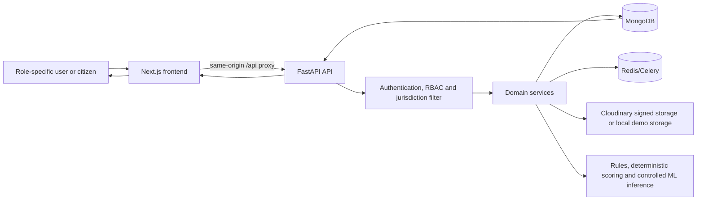

# SAMARTH AI MPLADS — final repository report

**Audit date:** 10 September 2026  
**Repository:** `C:\Users\ayush\OneDrive\Desktop\SIH 2.0`  
**Basis:** source inspection, live localhost API checks, current local MongoDB
state, and the commands recorded in [Testing and verification](#k-testing-and-verification).

> SAMARTH AI is a prototype decision-support application. It is not an
> official Government of India system, has no confirmed Government data
> connection, and does not make findings of fraud, misconduct, loss, or legal
> liability. Every risk, financial, duplicate, evidence, and ML signal needs
> human review.

## Executive finding

The repository contains a substantial, integrated Next.js/FastAPI/MongoDB
prototype. The API is registered, the frontend builds, authentication works
against the active local database, and all **183 backend tests pass** when the
explicit isolated MongoDB test database is enabled. The active local demo
database is healthy but intentionally sparse: it contains **8 demo users and
zero** allocation imports, works, scores, cases, evidence records, or model
registry records. Consequently, authentication is verified end-to-end, while
data-dependent dashboards and workflows correctly show empty states and must
not be described as currently populated operational workflows.

The two supplied CSVs are allocation-limit reference files, not work,
expenditure, payment, progress, or outcome data. They have not been imported
into the currently selected local demo database. The repository includes safe,
non-destructive synthetic data generators for demonstrations and ML testing.

---

## A. Project overview

### What it does and who it is for

SAMARTH AI is an assurance and delivery-management layer for MPLADS-style
public works. It supports work lifecycle data, financial/progress comparison,
rule-based risk prioritisation, controlled ML experimentation, possible
duplicate-work review, evidence verification, cases and inspections, citizen
social-audit reports, audit trails, and background job records.

Intended roles are `admin`, `mospi`, `state_nodal_officer`,
`district_authority`, `inspector`, `mp`, `agency`, and `citizen`. Citizens use
separate public projections; they cannot receive internal work, case, risk,
evidence, or restricted-financial data through the public API.

### Implemented architecture

| Layer | Actual implementation | Primary files |
|---|---|---|
| Web UI | Next.js 16 App Router, React 19, TypeScript, Tailwind 4, Radix-style local UI primitives, TanStack Query | `frontend/src/app`, `frontend/src/components`, `frontend/src/lib` |
| Charts/maps | Apache ECharts and Leaflet/react-leaflet | `frontend/src/components/financial/FinancialChart.tsx`, `frontend/src/components/*/*Map.tsx` |
| API | FastAPI 0.115, Pydantic v2, Motor/PyMongo async data access | `backend/app/main.py`, `backend/app/api/v1` |
| Business services | Dedicated services for work, ingestion, compliance, risk, ML inference, finance, duplicates, evidence, cases, citizen portal, notifications, jobs | `backend/app/services`, `backend/app/ml` |
| Database | MongoDB: Atlas is production-oriented; explicit local development fallback is supported | `backend/app/core/database.py`, `backend/app/core/config.py` |
| Auth and access | bcrypt password hashes, short access JWTs, MongoDB-backed rotating refresh sessions, CSRF double submit, RBAC and jurisdiction query filters | `backend/app/core/security.py`, `dependencies.py`, `permissions.py`, `services/auth_service.py` |
| Storage | Signed authenticated Cloudinary upload when configured; local private demo files otherwise, never enabled in production | `backend/app/services/evidence_verification_service.py` |
| Background work | Celery with Redis broker/result backend, persistent MongoDB job records, scheduled dispatch | `backend/app/celery_app.py`, `backend/app/tasks/background_tasks.py` |
| Deployment | Docker Compose variants, Dockerfiles, staging/production environment templates and operational runbooks | `docker-compose*.yml`, `DEPLOYMENT.md` |



The frontend rewrite in `frontend/next.config.ts` proxies `/api/:path*` to
`NEXT_PUBLIC_API_URL` or `http://localhost:8000`. Browser calls remain
same-origin; FastAPI remains the system-of-record boundary.

---

## B. Folder and file documentation

### Project tree

```text
SIH 2.0/
├─ frontend/                         Next.js UI and browser tests
│  ├─ src/app/                       App Router pages, layouts and API health proxy
│  ├─ src/components/                dashboard, maps, charts, notifications, UI primitives
│  ├─ src/lib/                       auth context, query helper, API types/formatters
│  ├─ e2e/                           opt-in Playwright contract
│  ├─ Dockerfile, next.config.ts, vitest.config.ts, playwright.config.ts
├─ backend/                          FastAPI application and Python tests
│  ├─ app/api/v1/                    HTTP route modules (controllers)
│  ├─ app/core/                      config, database, auth dependencies, middleware, RBAC
│  ├─ app/models/                    Pydantic request, response and persisted-document schemas
│  ├─ app/services/                  MongoDB-backed domain business logic
│  ├─ app/ml/                        features, train/evaluate, registry, inference, explainability
│  ├─ app/tasks/                     Celery task implementations
│  ├─ scripts/                       seed, dataset generation and deployment utilities
│  ├─ tests/                         pytest unit, service, security and workflow tests
│  ├─ Dockerfile, requirements.txt
├─ data/                             canonical allocation CSV reference files and provenance note
├─ docs/                             source-derived inventories and earlier verification notes
├─ docker-compose*.yml               base/local/staging/production compositions
├─ .env.example                      development configuration template
├─ .env.staging.example              staging configuration template
├─ .env.production.example            production configuration template
└─ README.md and operational runbooks
```

### Important folders and files

| File/folder | Purpose and main contents | Used by | Status |
|---|---|---|---|
| `frontend/src/app/layout.tsx` | Root metadata, `AuthProvider`, TanStack `QueryProvider`, global CSS. | Every frontend route. | Active |
| `frontend/src/app/page.tsx`, `public/page.tsx`, `login/page.tsx` | Landing, citizen portal, and sign-in UI. | Next.js route loader. | Active |
| `frontend/src/app/dashboard/layout.tsx` | Adds the protected dashboard shell. | All `/dashboard/*` routes. | Active |
| `frontend/src/app/dashboard/{page,works,risk,compliance,financial,duplicates,cases,inspections,citizen-reports,analytics,settings}/page.tsx` | Role queues, work register/360, scoring, compliance, finance, duplicate review, cases, inspection, moderation, analytics and settings screens. Several legacy feature screens use inline styles, restyled globally. | Route loader; API-backed hooks/fetches. | Active; data-dependent views empty in active DB |
| `frontend/src/components/layout/dashboard-shell.tsx` | Role-filtered navigation, mobile drawer, sign-out, post-render unauthenticated redirect. | Dashboard layout. | Active and tested |
| `frontend/src/components/dashboard/role-overview.tsx` | Role-specific overview cards and queues. | Dashboard home. | Active; MongoDB API data only |
| `frontend/src/components/{financial,duplicates,inspections,maps}` | ECharts financial component and Leaflet maps. | Relevant feature pages. | Active |
| `frontend/src/components/notifications/*` | In-app bell and preference form. | Dashboard shell/settings. | Active |
| `frontend/src/components/ui/*` | Local button, input, card, badge, page heading and loading/empty/error primitives. | Newer dashboard pages. | Active |
| `frontend/src/lib/auth.tsx` | Login, refresh, logout, token state and authenticated fetch retry. | Root provider and all protected UI. | Active |
| `frontend/src/lib/query.ts`, `query-provider.tsx` | Typed error wrapper and TanStack Query setup. | Dashboard API reads. | Active |
| `frontend/src/lib/api.ts` | Shared TypeScript contracts, labels and formatters; it is not itself an HTTP client. | Feature pages. | Active |
| `frontend/src/proxy.ts` | Lightweight cookie-presence dashboard redirect; API remains final authority. | Next.js middleware/proxy. | Active and tested |
| `frontend/e2e/phase17-workflow.spec.ts` | Opt-in API-driven Playwright District→Inspector→Citizen privacy contract. | `npm run test:e2e`. | Active, skipped unless `E2E_*` inputs are supplied |
| `backend/app/main.py` | App factory, lifespan, router registration, CORS, middleware, index creation. | Uvicorn/Celery imports. | Active |
| `backend/app/api/v1/*.py` | FastAPI controller/route groups. Exact inventory is in `docs/API_INVENTORY.md`. | Registered by `main.py`. | Active |
| `backend/app/core/config.py` | Pydantic settings, development fallback guards, production security validation. | Every API/worker process. | Active |
| `backend/app/core/database.py` | Motor client lifecycle and explicit local dev fallback. | Services and scripts. | Active |
| `backend/app/core/{security,dependencies,permissions,rate_limit,middleware}.py` | bcrypt/JWT/CSRF, current-user loading, RBAC and scope filters, Redis rate limits, headers/error masking. | Protected routes. | Active |
| `backend/app/models/*.py` | Pydantic schemas for users, works, imports, risk, ML, finance, duplicates, evidence, cases, citizen portal, jobs and audit. | Routes and services. | Active |
| `backend/app/services/*.py` | MongoDB-backed domain logic; no controller stores primary business records in in-memory arrays. | Route handlers and Celery tasks. | Active |
| `backend/app/ml/*.py` | Feature engineering, XGBoost/Isolation Forest training, evaluation, registry, inference, SHAP helpers. | Risk API and scripts. | Active; no artifacts registered in active DB |
| `backend/app/celery_app.py`, `app/tasks/background_tasks.py` | Celery app, queues, schedules and eleven durable task handlers. | Worker/Beat and background API. | Active code; worker not executed in this audit |
| `backend/scripts/{seed_users,seed_works,seed_evidence,seed_csv,generate_training_dataset}.py` | Environment-only user seeding; non-destructive synthetic work/evidence; CSV import; controlled ML dataset generation. | Manual demo/bootstrap. | Active; only users run in active DB |
| `backend/scripts/{backfill_import_batch_content_metadata,deployment_smoke_test}.py` | Explicit historic metadata backfill and optional deployment checks. | Operator-only. | Active utility, not run here |
| `backend/tests/*.py` | 183 pytest checks over rules, auth, scope, ingestion, risk, ML fallback, finance, duplicates, evidence, cases, citizens, security and jobs. | `pytest`. | Active; all passed in isolated test DB |
| `data/Allocated Limit for Honble MPs (1).csv` | Canonical Lok Sabha allocation-limit reference source. | Ingestion API/script/tests. | Available, unimported in active DB |
| `data/Allocated Limit for Honble MPs (2).csv` | Canonical Rajya Sabha allocation-limit reference source. | Ingestion API/script/tests. | Available, unimported in active DB |
| Root CSV copies | Byte-identical convenience copies of canonical `data/` sources. | No unique runtime need. | Redundant convenience copies |
| `docker-compose.yml` | Frontend, backend, Redis, Celery worker/beat using Atlas default. | Docker development/staging/production overlays. | Active config |
| `docker-compose.local.yml` | Local MongoDB overlay for synthetic/offline demo. | Local Compose only. | Active development-only config |
| `docker-compose.{staging,prod}.yml` | No mount, multi-worker deployment overlays. | Operator deployment. | Configured, not deployed |
| `backend/Dockerfile`, `frontend/Dockerfile` | Non-root production container images and health probes. | Compose/managed deployment. | Active config; Docker daemon unavailable during audit |
| `README.md`, `DEPLOYMENT.md`, `DEMO_RUNBOOK.md` | Setup, deployment and three/five-minute synthetic demo guides. | Operators. | Active documentation |
| `BACKUP_RESTORE_RUNBOOK.md`, `INCIDENT_RESPONSE_RUNBOOK.md`, `SECURITY_CHECKLIST.md` | Operational controls and pre-release checklists. | Operators. | Active documentation |
| `docs/API_INVENTORY.md`, `docs/DATA_INVENTORY.md`, `docs/DATASET_STATUS.md`, `docs/FEATURE_VERIFICATION.md`, `docs/ARCHITECTURE.md`, `docs/RECOMMENDATIONS.md` | Earlier source-derived analysis. Some live-state assertions are historical Atlas snapshots, not the current local DB. | Reference only. | Useful but superseded by this report for current state |

`__init__.py` files are package markers. `__pycache__`, `.next`,
`node_modules`, virtual environments, logs and `*.joblib` model artifacts are
generated/local and excluded by `.gitignore`; they are not source artifacts.

---

## C. Feature-by-feature report

The status column deliberately uses only the requested classifications.
“Fully implemented and tested” means a corresponding active path has passed
automated tests; it does **not** mean deployment approval or real data.

| Feature | Roles / UI | API, collection and core logic | Data and test evidence | Status |
|---|---|---|---|---|
| Login, logout, refresh and session revocation | All internal demo roles; `login/page.tsx`, shell | `/api/v1/auth/*`; `users`, `sessions`; bcrypt, JWT, rotating hashed refresh tokens and CSRF | Live proxy login/profile/logout 200; auth tests pass | Fully implemented and tested |
| User provisioning and administration | Admin API; no dedicated user-management screen | `/api/v1/users`; `users`; unique email/username, active/role updates, last-admin protection | Backend tests; active DB has 8 seeded roles | Backend only |
| RBAC and jurisdiction access | API-enforced; navigation is role-filtered UX | `core/permissions.py`, dependencies and scoped `works` queries | Security/RBAC/jurisdiction tests pass | Fully implemented and tested |
| Dashboard and role queues | `/dashboard`, `role-overview.tsx` | Work/risk/finance/case endpoints | Build/lint pass; active queues empty | Implemented but partially working |
| Work lifecycle, Work 360, search/filter/sort/page | Internal roles according to permission; work pages | `/api/v1/works/*`; `works` with embedded payments/progress/timeline; whitelist filters, audit records | Lifecycle/scope tests pass; active DB has no works | Implemented but partially working |
| MP/state/constituency allocation reference ingestion | Privileged API; no dedicated UI | `/api/v1/ingestion/*`; `import_batches`, `states`, `constituencies`, `mps`, `mp_allocations` | Isolated real-Mongo pipeline tests pass; active DB not imported | Backend only |
| District and agency registries | Work fields and synthetic generator values only | No dedicated authoritative registry API/collection | No source dataset supplied | Blocked by missing dataset |
| Payments, fund releases and expenditure | Work 360 and finance views | Work embedded `payment_tranches`, financial fields | CRUD/calculation code and tests; no active work records | Implemented but partially working |
| Financial intelligence | `/dashboard/financial`, ECharts | `/api/v1/financial-intelligence/*`; scoped `works`; gap, benchmarks, outliers, trend | Financial service tests pass; empty active source | Implemented but partially working |
| Compliance engine | `/dashboard/compliance` | `/api/v1/compliance/*`; `compliance_rules`, `compliance_results` | Rule tests pass; no active records/rules seeded | Implemented but partially working |
| Composite risk scoring | Risk centre and Work 360 | `/api/v1/risk/*`; `risk_scores`, denormalised latest score on `works` | Determinism and real-Mongo persistence tests pass | Fully implemented and tested |
| ML delay/anomaly inference | Risk API exposes persisted result; no training UI | XGBoost/Isolation Forest scripts, `model_registry`, `model_predictions`; approved artifact or labelled deterministic fallback | Feature/fallback and real-Mongo persistence tests pass; no artifact/model in active DB | Implemented but partially working |
| Possible duplicate-work detection | Duplicate Explorer and comparison map | `/api/v1/duplicates/*`; scan/match/cluster/case collections; TF-IDF/cosine, category, cost, time, agency and geo signals | Service tests pass; no active work pairs | Fully implemented and tested |
| Evidence verification/upload | Evidence and inspector pages | `/api/v1/evidence/*`; `evidence_metadata`, image-match records; SHA-256/pHash/EXIF/GPS/distance | Evidence and privacy tests pass; active DB has no evidence, Cloudinary not configured | Implemented but partially working |
| Case management and inspection | District case screens; Inspector task screens | `/api/v1/cases/*`; `cases`, `inspection_reports`, `case_notifications` | Full service workflow and E2E-style backend tests pass; browser E2E not configured | Fully implemented and tested |
| Citizen search, issue and moderation | `/public`, moderation page | `/api/v1/public/*`, `/api/v1/citizen-reports/*`; `citizen_issues`, challenges | Privacy/allowlist and workflow tests pass; needs a work record to demonstrate live | Fully implemented and tested |
| Notifications/preferences | Bell and settings component | `/api/v1/background/notifications*`; `notifications`, preferences, deliveries | Persistence/privacy tests pass; external adapters default disabled | Implemented but partially working |
| Background jobs and manual escalation | No full job-admin UI | `/api/v1/background/*`; `background_jobs`; Celery tasks and idempotency | Job/escalation tests pass; worker/beat not run in audit | Implemented but not tested |
| Audit trail | No dedicated audit-log page | `audit_logs`, `AuditService`; auth/work/risk/evidence/case/citizen writes | Services tested; live login/logout created records | Backend only |
| Analytics/reports | `/dashboard/analytics` | Reads finance/risk APIs; background report task writes `generated_reports` | UI/API read exists; no downloadable report route and no live data | Implemented but partially working |
| Health/readiness | No dashboard needed | `/health`, `/ready`, `/api/v1/health` | Live: all `ok`, MongoDB/Redis `ok` | Fully implemented and tested |
| Deployment/operations | Documentation and Compose | Dockerfiles, Compose, templates/runbooks | Build config inspected; no deployed URL; Docker daemon unavailable | Implemented but not tested |

### Explicit missing or partial functionality

- There is no registration/self-service password reset flow. Users are seeded or
  created by an admin and can change a known password.
- There is no dedicated frontend ingestion/allocation history, user-management,
  audit-log, or generated-report download screen despite backend support.
- Import retry exists; a batch-scoped import rollback does not.
- Email, SMS, WhatsApp provider adapters are interfaces with default-disabled
  adapters, not live provider integrations.
- No authoritative work, district, agency/vendor, payment, expenditure,
  progress, location, or historical outcome dataset is included.
- No model artifact is checked in or registered in the active database. Live
  prediction falls back to a labelled deterministic heuristic until an approved
  artifact is present.

---

## D. Dataset and data-flow report

### Available source datasets

| Dataset | Canonical path | Source / parsed / valid rows | Invalid / duplicate rows | Storage target | Active DB state | Suitability |
|---|---|---:|---:|---|---|---|
| Lok Sabha allocation limits | `data/Allocated Limit for Honble MPs (1).csv` | 544 / 543 / 543 | 0 / no exact source duplicates; reimport dedupes by `data_hash` | `import_batches`, `states`, `constituencies`, `mps`, `mp_allocations` | Unimported | Reference allocation data only; unsuitable as work/progress/ML labels |
| Rajya Sabha allocation limits | `data/Allocated Limit for Honble MPs (2).csv` | 232 / 231 / 231 | 0 / no exact source duplicates; reimport dedupes by `data_hash` | `import_batches`, `states`, `mps`, `mp_allocations` | Unimported | Reference allocation data only; unsuitable as work/progress/ML labels |
| Synthetic MPLADS-style generator | `backend/scripts/generate_training_dataset.py` | Configurable; defaults to 1,550 works | Controlled synthetic scenarios | Multiple demo/training collections | Not run in active DB | Suitable only for synthetic training/evaluation and demonstrations |
| Small synthetic work/evidence seed | `backend/scripts/seed_works.py`, `seed_evidence.py` | ~20 works / six evidence scenarios | Controlled only | `works`, `evidence_metadata`, image matches | Not run in active DB | Demo only |

The root CSV copies are byte-identical to the `data/` files. SHA-256 values:

- Lok Sabha: `DB419A582D351BDD54CB3C14310287FBAB385907F803F9287FA8875BBD43DCD3`
- Rajya Sabha: `C42CB2A25B79ABB765366EE12AC5E60CD922808553FF18CB38B606E7B2DF0F86`

### Allocation ingestion pipeline

```text
CSV bytes → UTF-8/BOM parsing → header type/mapping detection → preview
→ row validation → staged import_batches record → normalisation/upsert
states/constituencies/mps → unique SHA-256 allocation data_hash insert
→ MongoDB → protected ingestion API
```

The batch stores file name/type, headers, mapping, raw staging content,
source-byte SHA-256, size, encoding, row outcomes, timestamps and audit
events. Validation checks state, MP name, amounts, Lok Sabha constituency and
Rajya Sabha elected/nominated values. Duplicate allocations are skipped using
a unique `data_hash`; same data can safely be re-imported. Invalid rows are
returned by `/batches/{batch_id}/invalid`. A retry exists for failed/partial
batches. **Rollback is not implemented.**

The isolated real-Mongo tests verified both full pipelines and a Rajya Sabha
re-import, but those test records were written only to `samarth_ai_test`.
The active `samarth_ai` database reports `0` import batches and `0` rows in
all five ingestion collections. Therefore no available CSV has been imported
into the active demo.

Allocation values are explicitly separated from work facts. They must not be
used to claim a work was sanctioned, paid, completed, delayed, anomalous, or
irregular.

---

## E. MongoDB database report

### Configuration and actual state

`MONGODB_URI` is the normal connection setting. In production,
`config.py` rejects non-SRV Mongo URIs and any development fallback settings.
For this local demo, `MONGODB_DEV_FALLBACK_URI` plus
`MONGODB_USE_DEV_FALLBACK=true` deliberately selects local MongoDB. The live
`/ready` response is currently `ok` with MongoDB and Redis both `ok`.

The active database is `samarth_ai`. At audit time it contains 8 users, one
for each defined role, and no domain data. `samarth_ai_test` was used only for
the opt-in test run; it is separate from the active demo database.

### Collections and relationships

| Collection | Purpose and main fields | Relationships / indexes | Data source |
|---|---|---|---|
| `users` | `user_id`, email, username, bcrypt hash, role, jurisdiction, active status | Unique user/email/username; referenced by sessions, audit and workflows | Admin/seed |
| `sessions` | Hashed refresh token, CSRF token, expiry/revocation, IP/UA | Unique session ID, token hash, user ID, expiry TTL | Login |
| `audit_logs` | Event type, actor, target, request context, safe details, timestamp | Event/user/target/timestamp; optional configurable TTL | Services |
| `works` | Work identity, jurisdiction, financial fields, lifecycle, embedded location/payments/progress/timeline | Unique work ID; lifecycle/scope indexes; optional 2dsphere geo index | Operator or synthetic seed |
| `import_batches` | Staged upload metadata, raw content, mapping, validation/error counts | Unique batch ID | CSV upload |
| `states`, `constituencies`, `mps`, `mp_allocations` | Normalised allocation reference data and provenance | Unique normalized values/data hash, source-batch indexes | CSV ingestion |
| `compliance_rules`, `compliance_results` | Versioned rules and triggered/reviewed results | Rule/version and work/status/query indexes | Compliance runs |
| `risk_scores` | Immutable score, weight/subscore/rule/feature/explanation snapshots, confidence/action/version | Unique score and optional idempotency key; work/tier/time indexes | Scoring service |
| `model_registry`, `model_predictions` | Artifact/version/metric/approval metadata and immutable prediction snapshots | Model and prediction IDs; version/work/time indexes | Training/inference |
| `duplicate_detection_scans`, `duplicate_work_matches`, `duplicate_work_clusters`, `duplicate_work_cases` | Frozen scan policy, explainable matches/clusters/review cases | IDs, scan/match/status/similarity indexes | Duplicate service |
| `evidence_metadata`, `evidence_duplicate_image_matches` | Private metadata/hash/verification labels and pHash pair records | Evidence IDs, work/hash/time, pair keys | Evidence service |
| `cases`, `inspection_reports`, `case_notifications` | Case lifecycle, comments/events, reports, assignments and district notices | Case/report IDs; work/scope/inspector/status indexes | Case service |
| `citizen_issues`, `citizen_verification_challenges` | Anonymous report, public tracking state, consent boundary and short-lived challenge | Reference/work/status; challenge ID/expiry indexes | Public portal |
| `background_jobs`, `notifications`, `notification_preferences`, `notification_deliveries` | Job state/idempotency, in-app records, channel preference and delivery status | IDs/idempotency/user/status/time indexes | Background/notification services |
| `generated_reports`, `model_monitoring_reports` | Asynchronous aggregate report and model-monitoring outputs | No service-level index declaration found | Celery tasks when run |
| `inspections`, `ref_districts` | Referenced by compliance lookups only | No dedicated API/seed flow found | Optional/external; currently incomplete |

Work child data is embedded in `works`; case/evidence/model/score data uses
`work_id` references. MongoDB is the production application source of truth.
Tests use `MemoryDatabase` doubles for fast unit/service coverage, but live
login, user listing, health, and the isolated integration tests also exercised
Motor against real MongoDB.

---

## F. API documentation

FastAPI exposes **102 paths / 113 HTTP operations / 153 OpenAPI schemas** in
the running development OpenAPI document. API versioning uses `/api/v1`, with
unversioned `/health` and `/ready` probes. Complete source inventory is in
`docs/API_INVENTORY.md`; below is the compact exact route-group inventory.

| Group and controller | Operations | Access and data |
|---|---|---|
| Health — `api/v1/health.py` | `GET /health`, `/ready`, `/api/v1/health` | Public liveness/readiness; reports dependency state |
| Authentication — `auth.py` | `POST /login`, `/logout`, `/refresh`, `/password-change`, `/sessions/revoke-all`; `GET /me`, `/sessions` | Public login; remaining operations authenticate, selected writes require CSRF; `users`, `sessions`, audit |
| Users — `users.py` | `GET,POST /api/v1/users`; `GET /{user_id}`; `PATCH /{user_id}/role`, `/{user_id}/status` | Admin-only management; `users`, sessions/audit |
| Works — `works.py` | `GET,POST /works`; `GET /{id}`, `/{id}/360`, `/{id}/timeline`, `/{id}/payments`, `/{id}/progress`; `PATCH /{id}`, `/{id}/status`; `DELETE /{id}`; `POST /{id}/payments`, `/{id}/progress` | RBAC+scope; `works` and audit |
| Ingestion — `ingestion.py` | `POST /upload`; `GET /batches`, `/{id}`, `/{id}/preview`, `/{id}/invalid`, `/stats`; `PUT /{id}/mapping`; `POST /{id}/validate`, `/{id}/import`, `/{id}/retry` | `UPLOAD_CSV`; reference/import collections |
| Compliance — `compliance.py` | Rule list/detail/create/version update/seed; one/batch run; results list/detail/review | Compliance permissions and scope; rule/result collections |
| Risk/ML — `risk.py` | Score one/explicit/batch; predict/get prediction; list/approve/rollback models; distribution/list/get scores | Risk/model permissions and scope; score/model/prediction collections |
| Finance — `financial_intelligence.py` | `GET /financial-intelligence/filters`, `/dashboard` | Read work/payment permission + scope; derived from `works` |
| Duplicates — `duplicates.py` | scan, list, clusters, comparison, create case, mark-not-duplicate, request verification | Investigation permission + scope; duplicate collections |
| Evidence — `evidence.py` | upload signature, local upload, Cloudinary completion, pHash scan, list/detail | Evidence permission + scope/rate limit; private metadata/storage |
| Cases — `cases.py` | create/list/detail/assignees and all lifecycle actions; inspector assigned queue/task/report; notices | Manager or assigned inspector roles + scope; case/report/evidence/risk/notices |
| Public — `public.py` | safe work search/detail/QR, challenge, issue submit/evidence/tracking | Public, allowlisted response projection/rate limit; works/issues/challenges |
| Citizen moderation — `citizen_reports.py` | list/detail/update status | Internal manager roles + work scope; citizen issues |
| Background — `background.py` | job list/detail/queue, manual escalation, notification list/read/preferences | Privileged role + scope where relevant; jobs/notifications |

Route handlers use Pydantic request validation and return Pydantic response
schemas. List endpoints use bounded page/page-size parameters. `WorkService`
has allowlists for filters/sorts; public responses are separate models rather
than filtered internal work documents. Errors use FastAPI validation/HTTP
responses and production middleware masks unhandled 500 details with a request
ID. CORS accepts explicit origins only; wildcard CORS is rejected by config.

The frontend calls the following connected API domains: auth, works, risk,
financial intelligence, compliance, duplicate explorer, evidence, cases,
citizen moderation, public portal and background notifications/preferences.
Backend-only domains include CSV ingestion, user management, full model
management, background job control and most audit operations.

---

## G. Frontend report

The application contains 19 generated Next.js routes. `npm run build` passed
the TypeScript check and static/dynamic route generation. The central auth
context calls `/api/v1/auth`, retains the access token in React memory, uses
the HTTP-only refresh cookie, sends a CSRF header for state-changing refresh
and logout, and retries one authenticated request after 401 refresh.

| Page/component path | Main API data and behaviour | Current state |
|---|---|---|
| `/`, `/login` | Public landing; auth login/restore | Login verified through Next proxy |
| `/dashboard` | Role overview; work/risk/finance/case queries | Loading/error/empty states; empty active queues |
| `/dashboard/works`, `/dashboard/works/[workId]` | Work list and Work 360/timeline/risk | API-connected; no active data |
| `/dashboard/risk`, `/dashboard/compliance` | Score/results/rules lists and actions | API-connected; no active scores/rules |
| `/dashboard/financial`, `/analytics` | Finance dashboard/risk distribution, ECharts | API-connected; no active work data |
| `/dashboard/duplicates`, `/duplicates/[matchId]` | Scan/match/side-by-side map | API-connected; no active candidates |
| `/dashboard/evidence` | Private evidence list/upload-related controls | API-connected; no active evidence |
| `/dashboard/cases`, `/cases/[caseId]` | Case lifecycle/assignment/review | API-connected; no active cases |
| `/dashboard/inspections`, `/inspections/[caseId]` | Assigned queue, checklist, browser GPS, map/navigation, evidence selection, offline visual state | API-connected; needs assigned case |
| `/dashboard/citizen-reports` | Internal moderation list/detail/status actions | API-connected; needs report/work |
| `/dashboard/settings` | Current user and password/preferences controls | API-connected |
| `/public` | Search, QR lookup, demo verification, issue/tracking and optional evidence | Separate public API projection; needs public work to demonstrate search |
| `DashboardShell`, `RoleOverview` | Navigation and high-level queues filtered by role | Navigation UX only; backend remains authority |
| `FinancialChart`, maps | ECharts and Leaflet rendering from API coordinates | No hardcoded operational metric series; data empty currently |

Newer screens use reusable controls and state components. Several older
feature pages retain inline style objects and are visually restyled from
`globals.css`; this is maintainable but should be migrated to the shared UI
components before a production launch. The frontend has no primary dashboard
mock data: the active content comes from API responses, hence empty states are
visible in the current sparse DB.

Frontend test source covers login error/redirect, dashboard states, navigation
role filtering, middleware redirect, shared states and health proxy. The
Vitest command did not start in this environment due a Windows/esbuild
access-denied configuration load failure; no assertions ran in that command.

---

## H. Authentication, security and access control

| Control | Actual implementation | Audit result / limitation |
|---|---|---|
| Passwords | `passlib` bcrypt hashes; rejects passwords over bcrypt's 72-byte boundary | Tested; runtime logs an upstream bcrypt/passlib version warning, but hashes/login work |
| Access/refresh tokens | JWT access token contains subject/session only; fresh user/role/status loaded from DB. Refresh token is hashed in `sessions`, rotated on refresh and revoked on logout. | Login/profile/logout verified live; tests pass |
| Cookies and CSRF | Refresh cookie is HTTP-only, scoped to auth; Secure flag in production. CSRF cookie/header double-submit protects applicable auth writes. | Implemented/tested; secure cookie depends on production environment/TLS |
| Rate limiting | Redis counters for login, public issue and upload; rate limiter fails open when Redis is unavailable. | Implemented/tested; fail-open is an availability trade-off |
| RBAC/IDOR/scope | Permission dependencies plus Mongo query scope; out-of-scope case/evidence paths return 404 where appropriate. | Tests pass including citizen privacy restriction |
| Validation/file safety | Pydantic bounds and format checks, body-size middleware, CSV binary/size checks, image MIME/content inspection. | Tests pass; security review still required before deployment |
| Headers/CORS | Explicit CORS, no wildcards; CSP, nosniff, frame denial, referrer, permissions and HSTS in production. | Tested configuration/security headers |
| Audit logging | Auth, access-denied, work, rule, scoring, evidence, case, citizen and model events write safe structured audit records. | Tested and live login/logout records observed |
| Secret management | `.env` ignored; templates use placeholders; seed script needs external environment values. | Correct source pattern, but operator must use a real secret manager |

Remaining security work: pin/verify the passlib-bcrypt compatibility warning,
configure provider secrets and TLS, run an independent penetration test,
validate a real reverse-proxy trusted-header setup, secure MongoDB/Redis
networking, and establish access/audit retention policies. There is no password
reset or MFA implementation.

---

## I. File storage and evidence report

Evidence bytes and evidence metadata are distinct. In development, local demo
bytes are written under the backend-local evidence root by
`EvidenceVerificationService`; MongoDB stores a private storage reference plus
verification metadata. In production, only signed authenticated Cloudinary
uploads are allowed; production startup rejects absent/placeholder Cloudinary
settings and local storage is disabled.

The service reads image bytes, enforces maximum request size and supported
image content, generates SHA-256 and a 64-bit perceptual hash, extracts EXIF,
GPS and timestamp when present, calculates Haversine distance from the work,
evaluates timestamp/GPS labels, and scans pHash pairs across projects. Safe
metadata responses deliberately omit original filenames, storage references,
direct image URLs, raw coordinates and matching internals. Citizens have no
internal evidence permission and the public API never exposes private files.

Supported safe result labels are: `Verified metadata available`, `Metadata
unavailable — manual verification required`, `GPS mismatch — verification
recommended`, `Timestamp inconsistency — verification recommended`, and
`Possible reused evidence — manual verification required`.

Evidence tests pass, including private-access restrictions and local/Cloudinary
configuration behaviour. No evidence currently exists in the active DB and no
Cloudinary account was configured, so no real remote upload was audited.

---

## J. ML and risk-intelligence report

### Risk scoring

`RiskScoringService` in `backend/app/services/risk_service.py` is deterministic
for fixed inputs and timestamp. Its versioned default weights are Time 25%,
Financial 25%, Duplicate 20%, Evidence 15%, Compliance 15%. It stores a
0–100 score, Green/Amber/Red tier, sub-scores, triggered rules, feature and
explanation snapshots, model/score versions, timestamp, confidence,
recommended action, supporting references and the disclaimer:

> **AI signal — requires human review.**

Scores are append-only in `risk_scores`; `works` receives only a denormalised
latest score/tier for list display. Determinism and real-Mongo persistence are
tested.

### ML lifecycle and limits

`train_delay_model.py` builds an `XGBClassifier` using reproducible
train/test splitting and records precision, recall, F1, ROC-AUC, confusion
matrix, feature importance and SHAP availability. `train_anomaly_model.py`
builds an Isolation Forest for unexplained financial/execution patterns; it is
not a fraud classifier. `feature_engineering.py` intentionally excludes the
synthetic `_anomaly_tags` from live inference features to avoid leakage.

Training artifacts are local `*.joblib` files (ignored by Git) with metadata
in `model_registry`: version, type, artifact path, feature schema, dataset
version, training date/metrics, approval status and rollback state.
Predictions in `model_predictions` retain work/version/time/probability/anomaly
score, features, explanation and rule IDs. Only approved artifacts can be
used. If no approved artifact is available, inference writes an explicitly
labelled `deterministic_heuristic_fallback`; it is not presented as ML.

The active DB has zero model registry/prediction records and the repository
contains no model artifact. The only labels available are controlled synthetic
tags. There is no real historical outcome dataset, so no operational accuracy
claim is justified and no reported synthetic holdout metric applies to real
works.

---

## K. Testing and verification

### Commands executed for this report

| Command/check | Actual result |
|---|---|
| Active `GET /health`, `/ready`, frontend `/api/health` | All `ok`; MongoDB and Redis `ok` |
| Auth through frontend proxy | Login, `/me`, logout all HTTP 200 for existing demo admin; test session immediately logged out |
| Active user check | 8 roles/users; all domain collections checked through authorized endpoints reported zero active records |
| `frontend: npm run lint` | Passed |
| `frontend: npm run build` | Passed; production TypeScript check and 19 routes generated |
| `frontend: npm run test` | Did not start: esbuild could not read a parent directory / resolve `vitest.config.ts` due Windows access denial |
| `frontend: npm run test:e2e` | 1 skipped by design; requires `E2E_ALLOW_MUTATIONS=true` plus isolated test role credentials, inspector ID and work ID |
| `backend: python -m pytest -q` default | 173 passed, 10 skipped, one Starlette deprecation warning |
| Isolated opt-in Mongo subset | 42 passed in 13.19s using local `samarth_ai_test` |
| Complete isolated backend suite | **183 passed in 21.77s**, one upstream Starlette `BlockingPortal` deprecation warning |
| Source compilation | `py_compile` succeeded for changed config/database/seeder source |
| Docker availability | Docker CLI installed, Docker daemon unavailable; Compose was not started |

The ten default skips were intentionally guarded real-Mongo ingestion,
prediction and risk persistence tests. They were all included in the final
183-pass isolated run. Browser E2E was not run because it would mutate data
and no disposable browser test fixture/credentials were provided. The failed
Vitest command is an environment/sandbox access failure, not a failed
assertion; it remains a release blocker until resolved on a normal workstation
or CI runner.

---

## L. Deployment and operations report

### Local commands

```powershell
# Backend, from backend/
.\.venv311\Scripts\python.exe -m uvicorn app.main:app --host 127.0.0.1 --port 8000
.\.venv311\Scripts\python.exe -m pytest -q

# Frontend, from frontend/
npm run dev
npm run lint
npm run build

# Full local Compose stack when Docker Desktop is available
docker compose -f docker-compose.yml -f docker-compose.local.yml up --build
```

Production requires Node 20, Python 3.11–3.12, MongoDB Atlas with a restricted
network policy, private authenticated/TLS Redis, an HTTPS reverse proxy,
Cloudinary credentials, secret-manager values, and separately deployed API,
worker, beat and frontend services. Required settings are documented in
`.env.example`, `.env.staging.example` and `.env.production.example`; do not
place secret values in source or this report.

Health endpoints are `/health` and `/ready`. Dockerfiles have liveness probes;
Compose runs Redis, backend, frontend, Celery worker and Beat, adding local
Mongo only with the local overlay. `BACKUP_RESTORE_RUNBOOK.md` and
`INCIDENT_RESPONSE_RUNBOOK.md` provide the existing backup/incident guidance.

There are no deployed URLs in the repository and none were created during this
audit. Docker could not be verified because the daemon is not running.

---

## M. Final project status

| Area | Built | Working now | Tested | Uses real data | MongoDB connected | Frontend connected | Production ready |
|---|---|---|---|---|---|---|---|
| Authentication | Yes | Yes | Yes | Demo accounts only | Yes | Yes | No |
| RBAC/scope | Yes | API path | Yes | N/A | Yes | Partial UI | No |
| Dashboard | Yes | Empty-state only | Build/API tests | No | Yes | Yes | No |
| CSV ingestion | Yes | Code/test DB | Yes | Supplied reference files only | Yes | No dedicated UI | No |
| Works and finance | Yes | No active records | Yes | No | Yes | Yes | No |
| Evidence | Yes | Config/test path | Yes | No | Yes | Yes | No |
| Risk and ML | Yes | Fallback-capable only | Yes | Synthetic only | Yes | Yes | No |
| Duplicates/cases/citizens | Yes | Requires work data | Yes | No | Yes | Yes | No |
| Notifications/jobs | Yes | API/data model | Yes | No | Yes | Partial UI | No |
| Deployment | Config/docs | Not deployed | Partial | N/A | Local only | Local only | No |

### Direct answers

1. **Fully built:** core auth, RBAC/scope framework, FastAPI route surface,
   MongoDB services, deterministic scoring, synthetic ML pipeline/fallback,
   duplicate/evidence/case/citizen workflows, background job model, frontend
   feature pages, Compose and runbooks.
2. **End-to-end now:** local health/readiness, login/profile/logout and
   frontend proxy. Data workflows cannot be demonstrated because the active
   database has no works/imports.
3. **Tested:** all 183 backend tests in a separate local test DB, lint/build,
   live auth/health. Vitest and mutating browser E2E remain unexecuted.
4. **Feature file locations:** listed in sections B–J; route-level inventory
   is `docs/API_INVENTORY.md`.
5. **Dataset storage:** canonical files are `data/*.csv`; ingested allocation
   records would be MongoDB reference collections. Synthetic generators write
   only when explicitly run on an empty demo DB.
6. **Data movement:** CSV/evidence/work inputs pass API validation and domain
   services into MongoDB; API responses feed TanStack Query pages; scoring/ML
   read Mongo records and persist immutable snapshots.
7. **Mongo collections:** listed in section E.
8. **Frontend-connected APIs:** auth, works, risk, finance, compliance,
   duplicates, evidence, cases, public/citizen moderation and notifications.
9. **Real data:** only the supplied allocation CSV reference sources are
   present. Their provenance/authenticity has not been independently verified.
10. **Synthetic/placeholder:** works/evidence/training labels/model metrics
    are synthetic when seeded; inference uses a labelled heuristic absent an
    approved artifact. Active DB currently has no such data.
11. **Missing datasets:** authoritative work/financial/progress/payment/history,
    agency/vendor/district registry, locations/evidence and real outcome labels.
12. **Incomplete features:** import rollback, dedicated ingestion/admin/audit
    frontend pages, provider delivery integrations, password reset/MFA,
    report download, full UI migration off inline styles, deployed monitoring.
13. **Security issues remaining:** no independent pen test/MFA/reset; Redis
    rate limiting fails open; bcrypt/passlib compatibility warning; deployment
    secrets/TLS/network policy must be supplied and verified.
14. **Production ready?** No. It is a well-tested prototype, not a deployed
    production service.
15. **Before deployment:** supply and validate real sources, create staging,
    configure Atlas/Redis/Cloudinary/TLS/secrets, execute browser E2E and
    Vitest in CI, run security testing, migrate UI gaps, then perform a staged
    load/backup/restore/incident drill.
16. **Next implementation priority:** import an approved work-level source into
    a disposable staging DB; build the missing ingestion/admin/audit UI;
    establish CI and production observability; then calibrate/review models.
17. **Inputs needed from the operator:** authoritative, approved work and
    reference datasets; data-governance decisions; staging/production hosting,
    Atlas, Redis and Cloudinary credentials; provider approval for outbound
    notifications; test-domain/TLS details; retention and escalation policy;
    disposable E2E fixture identities and work IDs.

