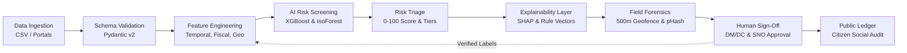
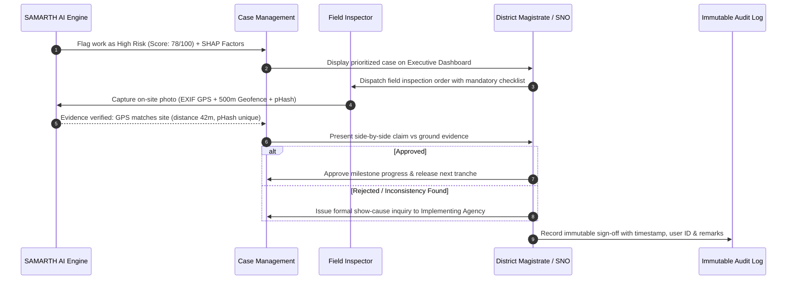
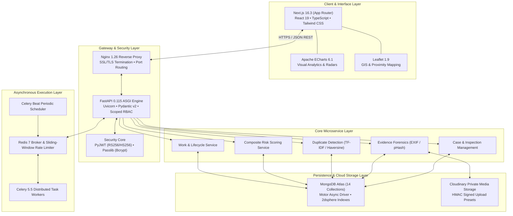

# SAMARTH AI

### AI-Powered MPLADS Monitoring, Risk Intelligence & Proactive Governance Platform

[](https://www.sih.gov.in/)
[](https://www.sih.gov.in/)
[](https://13-203-65-170.sslip.io)
[-black.svg?style=flat-square&logo=next.js)](https://nextjs.org/)
[](https://fastapi.tiangolo.com/)
[](https://www.mongodb.com/)
[](https://redis.io/)
[](https://docs.celeryq.dev/)
[](https://xgboost.readthedocs.io/)
[-lightgrey.svg?style=flat-square)](#43--license)

**SAMARTH AI** transforms Member of Parliament Local Area Development Scheme (MPLADS) governance from fragmented, retrospective manual audits into a proactive, data-driven risk intelligence ecosystem. By synthesizing project metadata, milestone velocities, geospatial proximity, and forensic photo evidence, the platform scores and explains risks before public funds face irreversible loss.

> *"SAMARTH AI does not replace government decision-makers; it helps them decide where attention is needed first, why a case is risky, and what evidence should be reviewed."*

---

## 2. At a Glance

| Dimension | SAMARTH AI Platform Specification |
| :--- | :--- |
| **Domain** | Public Governance, GovTech, Financial Accountability & Civic Assurance |
| **Target Problem** | Unmonitored milestone slippage, ghost/duplicate projects, expenditure-vs-progress mismatch, and unverified field evidence across MPLADS works |
| **Primary Users** | Central Ministry (MoSPI), State Nodal Officers (SNO), District Authorities (DM/DC), Implementing Line Agencies, Field Inspectors, Members of Parliament (MPs), and Citizens |
| **Core Capabilities** | Multi-engine risk scoring (0–100), 50m/500m geospatial duplicate clustering, tamper-proof EXIF/pHash photo forensics, explainable AI (SHAP) attributions, and immutable audit logging |
| **AI / ML Layer** | Supervised XGBoost (delay regression/classification), Unsupervised Isolation Forest (financial/progress anomalies), SHAP TreeExplainer (local interpretability), TF-IDF + Cosine Similarity (text deduplication) |
| **Backend Architecture**| FastAPI 0.115 (Asynchronous ASGI), Pydantic v2.11 schema validation, Motor 3.7 non-blocking MongoDB ODM, Celery 5.5 distributed workers backed by Redis 5.3 |
| **Frontend Architecture**| Next.js 16.3 (App Router, Turbopack, SSR/CSR), TypeScript 5, Tailwind CSS v4, Apache ECharts 6.1 (Financial/Velocity visualizations), Leaflet 1.9 (GIS maps) |
| **Database & Storage** | MongoDB Atlas (14+ collections with 2dsphere and compound indexing) + Cloudinary (encrypted signed uploads) with private local demo store fallback |
| **Deployment Mode** | Docker & Docker Compose (Multi-container orchestration), AWS EC2 (Ubuntu 24.04 LTS), Nginx 1.26 (Reverse proxy & SSL termination), Let's Encrypt TLS, Jenkins CI/CD |
| **Current Status** | Functional End-to-End Working Prototype with active live cloud deployment (`https://13-203-65-170.sslip.io`) |

---

## 3. The Problem

Under the MPLADS guidelines administered by the Ministry of Statistics and Programme Implementation (MoSPI), each Member of Parliament is allocated ₹5 Crore annually to recommend developmental works addressing local public needs. Across 543 Lok Sabha and 245 Rajya Sabha constituencies, this amounts to an annual outlay exceeding ₹3,900 Crore across thousands of concurrent, scattered community projects.

```
TRADITIONAL MONITORING (REACTIVE & SLOW):
[Project Data] ──► [Static Paper/Portal Report] ──► [Manual Sample Review] ──► [Action Only After Loss/Delay]

SAMARTH AI PROACTIVE GOVERNANCE:
[Project Data] ──► [AI Risk Engine] ──► [Risk Prioritization (0-100)] ──► [Explainable Evidence] ──► [Human Decision] ──► [Action]
```

### Core Administrative Challenges
1. **Data Fragmentation:** Financial releases (PFMS), administrative sanctions, and physical milestone reports reside across disparate digital and manual silos.
2. **Exhaustive Manual Review Impossibility:** District Magistrates oversee hundreds of concurrent works; reviewing every ongoing asset manually is operationally infeasible.
3. **Retrospective Detection:** Irregularities, stalled timelines, or contractor abandonment are traditionally uncovered during post-completion audits months or years after public money has been released.
4. **Duplicate & Ghost Candidate Works:** Re-sanctioning existing community infrastructure or commissioning multiple identical works within close proximity is difficult to spot across historical records.
5. **Photographic Evidence Spoofing:** Inspection evidence is historically vulnerable to recycled photographs, stock images, or pictures captured far from the sanctioned site.
6. **Black-Box Alert Distrust:** Traditional automated systems flood officers with unexplained notifications, creating alert fatigue and bureaucratic resistance.

> **Language & Governance Standard:** SAMARTH AI never accuses or declares a project "fraudulent". The system produces objective, mathematically bounded **risk signals**, **potential anomalies**, and **candidate duplicate pairs** designed exclusively to guide authorized human inspection.

---

## 4. Problem &rarr; Gap &rarr; Solution

| Existing Challenge | Current Operational Gap | SAMARTH AI Solution | Codebase Evidence |
| :--- | :--- | :--- | :--- |
| **Manual Project Review** | Random sampling catches <5% of delayed or irregular works | **Automated Composite Risk Scoring (0–100)** prioritizes inspection queues | `backend/app/services/risk_service.py` |
| **Large Data Volume** | Officers face alert fatigue and cannot triage thousands of entries | **3-Tier Triage (Green/Amber/Red)** with automated case routing | `backend/app/models/risk.py` |
| **Duplicate Sanctions** | Manual title comparison fails across varying terminology | **Hybrid Spatial (Haversine ≤50m) + TF-IDF/Cosine (≥0.82)** deduplication | `backend/app/services/duplicate_detection_service.py` |
| **Geographic Blindspots**| Lat/Long stored as passive strings without proximity analysis | **GIS Layer + 2dsphere indexing + Leaflet cluster visualization** | `backend/app/api/v1/works.py` |
| **Late Delay Discovery** | Delays recognized only after statutory target date passes | **Supervised XGBoost regressor** predicts delay probability during execution | `backend/app/ml/train_delay_model.py` |
| **Black-Box Suspicion** | Bureaucrats ignore unexplained software flags | **SHAP TreeExplainer** gives local additive factor attribution | `backend/app/ml/explainability.py` |
| **Fake Photo Proof** | Field photos uploaded without hardware or spatial validation | **EXIF metadata extraction + 500m geofence lock + 64-bit DCT pHash** | `backend/app/services/evidence_verification_service.py` |
| **Cross-Jurisdiction Leaks**| Overlapping state/district officers see out-of-scope projects | **Defense-in-Depth RBAC** with database-level jurisdiction filters | `backend/app/core/permissions.py` |

---

## 5. Solution Overview

SAMARTH AI introduces a structured, closed-loop pipeline connecting project recommendation to final citizen accountability:



1. **Data Ingestion & Integrity:** Standardizes MPLADS CSVs and administrative entries via strict Pydantic schemas, checking required fields, statutory allocations (15% SC / 7.5% ST), and budget caps.
2. **Multi-Vector Machine Intelligence:** Background Celery workers compute financial velocity gaps, milestone progress lags, and spatial duplicate clusters.
3. **Transparent Explainability:** Every flagged work displays a human-readable attribution breakdown (e.g. `+30 points: 250m geo-overlap with existing asset; +25 points: 80% funds disbursed with <20% physical execution`).
4. **Forensic Field Inspection:** Assigned inspectors capture real-time site photos through mobile browsers. The engine extracts hardware EXIF GPS, validates a 500-meter site geofence, and computes perceptual image hashes against national photo registries.
5. **Human-in-the-Loop Determination:** District Magistrates and State Nodal Officers review side-by-side evidence, sign off on tranche releases, or issue show-cause inquiries.
6. **Public Ledger & Retraining Loop:** Approved assets display on an open citizen transparency portal. Human audit verdicts feed back into the training repository to continuously suppress false positives.

---

## 6. What Makes SAMARTH AI Different?

### 1. Risk-First Prioritization (The 80/20 Governance Rule)
Instead of forcing administrative bodies to inspect thousands of random works, SAMARTH AI isolates the highest-risk projects, allowing 80% of human inspection resources to concentrate where capital risk is concentrated.

### 2. Multi-Signal Fusion
Rather than relying on a single isolated metric, SAMARTH AI fuses five independent risk dimensions:
* **Timeline Risk (25% weight):** Recommendation-to-sanction delays, elapsed duration, and overdue days.
* **Financial Risk (25% weight):** Disbursement-to-progress divergence, expenditure acceleration, and peer category cost outliers.
* **Duplicate Risk (20% weight):** Exact title matches, TF-IDF lexical similarity, and geographic co-location.
* **Evidence Risk (15% weight):** Missing inspection records, completion without photographic proof, and upload gaps.
* **Compliance Risk (15% weight):** Violations of MoSPI guidelines, inadmissible works, and statutory quota shortfalls.

### 3. Transparent, Defensible AI (No Black Boxes)
In public governance, an unexplained machine learning output cannot justify withholding contractor funds or ordering formal inquiries. SAMARTH AI pairs predictive models with SHAP (Shapley Additive exPlanations) and rule-level severity breakdowns so every decision is legally defensible.

### 4. Non-Circumventable Field Forensics
Inspectors cannot upload recycled photos from internet searches or gallery screenshots. The system validates original camera hardware metadata, enforces a strict 500-meter site boundary, and compares 64-bit DCT perceptual hashes across all stored national evidence.

### 5. Deterministic Safe Fallback
If cloud ML runtimes or GPU/CPU model endpoints experience unexpected downtime, the core scoring pipeline gracefully falls back to deterministic heuristic evaluation (`deterministic-rules-v1.0.0`), clearly labelled in audit logs. The application never fails catastrophically.

---

## 7. Key Features & Implementation Matrix

| Capability / Module | Administrative Purpose | Implementation Status | Codebase Verification |
| :--- | :--- | :---: | :--- |
| **Executive Dashboards** | Role-scoped visual command centers for 8 administrative roles | 🟢 **Implemented** | `frontend/src/app/dashboard/*` |
| **Composite Risk Engine** | Versioned 0–100 risk scoring across 5 weighted dimensions | 🟢 **Implemented** | `backend/app/services/risk_service.py` |
| **Delay Prediction Model** | Gradient-boosted decision tree predicting project delays | 🟢 **Implemented** | `backend/app/ml/train_delay_model.py` |
| **Anomaly Detection Model**| Unsupervised Isolation Forest for financial/progress divergence | 🟢 **Implemented** | `backend/app/ml/train_anomaly_model.py` |
| **Explainable AI (SHAP)** | Local feature attribution explaining individual risk scores | 🟢 **Implemented** | `backend/app/ml/explainability.py` |
| **Duplicate Work Explorer** | Candidate pairing via TF-IDF (≥0.82) + Haversine (≤50m) | 🟢 **Implemented** | `backend/app/services/duplicate_detection_service.py` |
| **Geospatial GIS Engine** | District/Constituency maps, work clustering, and coordinates | 🟢 **Implemented** | `frontend/src/components/sno/JurisdictionCoverageMap.tsx` |
| **Field Evidence Forensics**| EXIF GPS parsing, 500m geofence validation, and pHash scan | 🟢 **Implemented** | `backend/app/services/evidence_verification_service.py` |
| **CSV Ingestion Pipeline** | Upload, column mapping, dry-run validation & idempotent import | 🟢 **Implemented** | `backend/app/services/ingestion.py` |
| **Case Management & SNO** | Lifecycle states: New &rarr; Under Review &rarr; Inspection &rarr; Resolved | 🟢 **Implemented** | `backend/app/services/case_management_service.py` |
| **Citizen Public Portal** | Zero-auth search, QR resolution, social audit issue submission | 🟢 **Implemented** | `frontend/src/app/public/page.tsx` |
| **Async Task Workers** | Celery + Redis for periodic scans, alerts, and background jobs | 🟢 **Implemented** | `backend/app/tasks/` |
| **Defense-in-Depth RBAC** | 8 administrative roles with strict jurisdiction query scoping | 🟢 **Implemented** | `backend/app/core/permissions.py` |
| **Immutable Audit Logging**| Append-only event tracking capturing user, IP, action & diffs | 🟢 **Implemented** | `backend/app/services/audit_service.py` |
| **Automated CI/CD** | Jenkins pipeline with GitHub Webhook zero-downtime deployment | 🟢 **Implemented** | Live on AWS EC2 (`13-203-65-170.sslip.io`) |
| **Offline PWA Sync** | Offline SQLite queue for zero-connectivity field audits | 🟡 **Prototype** | Mobile camera PWA client with local queue fallback |
| **Native eSAKSHI Sync API** | Real-time government direct API synchronization | 🔵 **Planned** | Standardized CSV/REST batch adapter implemented |

---

## 8. AI & Machine Learning Engine

```
                               ┌────────────────────────┐
                               │ Work Record & Context  │
                               └───────────┬────────────┘
                                           │
                        ┌──────────────────┴──────────────────┐
                        ▼                                     ▼
        ┌───────────────────────────────┐     ┌───────────────────────────────┐
        │  Supervised Delay Regressor   │     │  Unsupervised Anomaly Model   │
        │      (XGBoost v2.1.4)         │     │  (Isolation Forest v1.6.1)    │
        └───────────────┬───────────────┘     └───────────────┬───────────────┘
                        │ Delay Probability                   │ Outlier Score
                        └──────────────────┬──────────────────┘
                                           ▼
                               ┌────────────────────────┐
                               │  Explainability Engine │
                               │     (SHAP v0.46.0)     │
                               └───────────┬────────────┘
                                           │ Attributions (+30 Geo, +25 Fund)
                                           ▼
                               ┌────────────────────────┐
                               │ Composite Risk Scorer  │
                               │  (0 - 100 Risk Tier)   │
                               └────────────────────────┘
```

### 1. Delay Risk Prediction (XGBoost)
* **Algorithm:** Gradient-boosted decision trees (`XGBClassifier` / `XGBRegressor`).
* **Input Features (`FEATURE_COLUMNS`):** `sanctioned_amount_log`, `funds_released_pct`, `actual_expenditure_pct`, `physical_progress_pct`, `financial_progress_gap_pct`, `funds_excess_pct`, `expenditure_release_gap_pct`, `days_recommendation_to_sanction`, `days_since_start`, `planned_duration_days`, `schedule_elapsed_pct`, `progress_delay_pct`, `is_overdue`, `progress_update_count`, `days_since_last_progress_update`, `is_on_hold`, `is_in_progress`, `is_completed_or_verification`.
* **Target Objective:** Identifies works likely to experience severe delivery stalls (>90 days past scheduled completion).

### 2. Anomaly Detection (Isolation Forest)
* **Algorithm:** Unsupervised ensemble of isolation trees (`IsolationForest(contamination=0.05, random_state=42)`).
* **Input Features (`ANOMALY_FEATURE_COLUMNS`):** Concentrates purely on velocity ratios: funds released vs actual spend vs physical completion vs time elapsed.
* **Core Philosophy:** An anomaly is a statistical outlier—**it is not proof of fraud**. Legitimate projects facing unexpected rock excavations, seasonal monsoon pauses, or judicial stays will trigger anomalies. The model flags records solely for administrative prioritization.

### 3. Explainable AI (SHAP)
* **Framework:** `shap.TreeExplainer` applied to model tree ensembles.
* **Mechanism:** Computes exact Shapley values for individual records, ranking the top positive and negative contributors to the risk score.
* **Output:** Translates mathematical vectors into plain-language text visible on the District Magistrate's case dashboard:
  * *`+30.0 Points:`* Location within 250m of previously sanctioned community hall.
  * *`+25.0 Points:`* Financial release exceeds 75% while physical progress remains below 20%.
  * *`+15.0 Points:`* No progress update logged for >180 calendar days.

### 4. Duplicate & Ghost Asset Detection
* **Text Analysis:** Normalization, alphanumeric filtering, and TF-IDF n-gram vectorization with pairwise Cosine Similarity (default threshold $\ge 0.82$).
* **Spatial Cross-Validation:** Spherical geodesic distance computation via the **Haversine formula** (flagging pairs $\le 50$ meters apart).
* **Candidate Clustering:** Connected-component clustering grouping multiple overlapping proposals across consecutive financial years.

---

## 9. Composite Risk Scoring Architecture

SAMARTH AI generates an immutable, versioned composite risk score ($S \in [0, 100]$):

$$S = \sum_{i=1}^{5} \left( W_i \times \min(100, R_i) \right)$$

Where individual dimensions ($R_i$) and policy weights ($W_i$) are strictly calibrated:

| Risk Dimension | Policy Weight ($W_i$) | Core Triggers & Factors Evaluated |
| :--- | :---: | :--- |
| **Time Risk** | **0.25** | Days from recommendation to sanction, completion overdue while incomplete, missing progress updates. |
| **Financial Risk** | **0.25** | Funds released exceeding sanctioned budget, expenditure-vs-progress gap, category cost outliers (>1.5× median). |
| **Duplicate Risk** | **0.20** | Exact title matches in district, TF-IDF lexical overlap $\ge 0.82$, geodesic proximity $\le 50\text{m}$. |
| **Evidence Risk** | **0.15** | Work marked complete without photos, missing inspection reports, unverified uploads. |
| **Compliance Risk** | **0.15** | Inadmissible works, non-permissible sector allocations, SC/ST statutory quota shortfalls. |

### Classification Tiers
* 🟢 **Green (Low Risk: $0.00 - 34.99$):** Routine monitoring; automated milestone processing.
* 🟡 **Amber (Medium Risk: $35.00 - 64.99$):** Desk review required; automated notification sent to Implementing Line Agency.
* 🔴 **Red (High Risk: $65.00 - 100.00$):** Mandatory field inspection ticket generated; tranche release held pending District Magistrate review.

---

## 10. Human-in-the-Loop Governance

SAMARTH AI adheres strictly to the **Human-in-the-Loop (HITL)** governance doctrine. At no point does the artificial intelligence system possess the authority to cancel contracts, penalize agencies, or disburse public funds autonomously.



---

## 11. System Architecture

The SAMARTH AI repository implements a clean, decoupled 5-tier architecture:



---

## 12. Complete Data Flow

```
[MP Proposal / eSAKSHI CSV Import]
                │
                ▼
[FastAPI Ingestion Endpoint] ──► [Pydantic v2 Schema & Boundary Check]
                                                │
                                                ▼
                                [MongoDB Atlas ('works' collection)]
                                                │
                                                ├──────────────────────────────┐
                                                ▼                              ▼
                                     [Celery Asynchronous Task]      [Deterministic Rules]
                                                │                              │
                                                ▼                              ▼
                                    [XGBoost & Isolation Forest]     [Rule Severities]
                                                │                              │
                                                └──────────────┬───────────────┘
                                                               │
                                                               ▼
                                                  [Composite Score (0-100)]
                                                               │
                                                               ▼
                                                  [SHAP Factor Attribution]
                                                               │
                                                               ▼
                                                  [Risk Tier Triage Gateway]
                                                               │
                                         ┌─────────────────────┼─────────────────────┐
                                         ▼                     ▼                     ▼
                                    [Low Risk]           [Medium Risk]          [High Risk]
                                  (Auto Sanction)        (Desk Audit)        (Hold & Dispatch)
                                                                                     │
                                                                                     ▼
                                                                           [Field Inspection]
                                                                                     │
                                                                                     ▼
                                                                           [EXIF / pHash Proof]
                                                                                     │
                                                                                     ▼
                                                                           [Officer Determination]
                                                                                     │
                                                                                     ▼
                                                                           [Immutable Audit Log]
                                                                                     │
                                                                                     ▼
                                                                           [Public Transparency]
```

---

## 13. Data Model

The persistence layer in MongoDB Atlas relies on 14 specialized, strictly indexed collections:

### Core Entity: `works` (`WorkInDB`)
* **Identity:** `work_id` (UUIDv4), `title`, `description`, `status` (8-state enum), `category` (10-category enum), `sub_category`.
* **Geography & Administration:** `state_code`, `state_name`, `district_code`, `district_name`, `constituency`, `pincode`.
* **Stakeholders:** `mp_name`, `mp_id`, `implementing_agency`, `created_by`.
* **Fiscal Tracking:** `sanctioned_amount`, `funds_released`, `actual_expenditure`.
* **Lifecycle Timestamps:** `recommended_date`, `sanctioned_date`, `start_date`, `expected_completion_date`, `actual_completion_date`.
* **Physical Execution:** `physical_progress_pct` (Float 0–100), `progress_updates` (Array of snapshots).
* **Geospatial Location:** `location.latitude`, `location.longitude`, `location.address`, optional `location.geo` (GeoJSON Point).
* **Intelligence Signals:** `composite_risk_score`, `risk_tier` (`green`, `amber`, `red`), `sno_notice_issued`.
* **Auditing & Provenance:** `data_source` (`operator_entered`, `csv_import`, `synthetic_demo`), `created_at`, `updated_at`.

### Ancillary Collections
* `evidence_metadata`: Private image metadata, SHA-256, 64-bit DCT pHash, extracted EXIF camera data, calculated distance from site.
* `duplicate_work_matches`: Pairwise records connecting `left_work_id` and `right_work_id` with TF-IDF similarity, distance, and review state.
* `duplicate_work_cases`: Formal administrative investigation dockets opened on candidate duplicate clusters.
* `compliance_results`: Granular rule execution records (`rule_code`, `severity`, `contribution`, `evaluated_at`).
* `risk_scores`: Immutable historical snapshots of every computed composite score with full feature vectors.
* `model_predictions`: Machine learning inference runs capturing model version, raw probabilities, and SHAP attributions.
* `audit_events`: Append-only governance ledger tracking user ID, IP address, user agent, event type, and target resource.
* `citizen_reports`: Public social audit grievance submissions with masked tracking references.

---

## 14. CSV & Data Ingestion Engine

SAMARTH AI provides a multi-stage, idempotent CSV ingestion pipeline for batch government datasets:

```
[CSV Upload] ──► [Encoding & Size Check] ──► [Preview & Mapping] ──► [Row Validation] ──► [Idempotent Batch Import]
```

1. **Upload & Inspection:** Ingests CSV files with UTF-8 / Latin-1 encoding detection, file size limits (50MB), and header parsing.
2. **Column Mapping:** Flexible schema mapper maps heterogeneous state column titles to the standard SAMARTH schema.
3. **Dry-Run Validation:** Row-level validation verifies required fields, parses date sequences, and flags malformed financial amounts without touching production collections.
4. **Invalid Row Reporting:** Exports clean downloadable error reports highlighting the exact row index and validation error.
5. **Idempotent Import:** Deduplicates records via cryptographic hash (`data_hash`), ensuring that re-uploading identical datasets will not duplicate work entries.

---

## 15. Security Architecture

| Security Domain | Applied Mechanism | Implementation Level |
| :--- | :--- | :---: |
| **Authentication** | Stateless JSON Web Tokens (JWT) signed with RS256/HS256; short-lived access tokens + secure rotation | 🟢 **Implemented** |
| **Password Storage**| Cryptographic salting and hashing via Bcrypt (cost factor 12) through Passlib | 🟢 **Implemented** |
| **Access Control** | Granular Role-Based Access Control (RBAC) enforced on every API route via FastAPI dependencies | 🟢 **Implemented** |
| **Jurisdiction Boundary**| Automatic MongoDB query injection locking users to their assigned `state_code` and `district_code` | 🟢 **Implemented** |
| **Anti-DDoS / Rate Limit**| Redis-backed sliding-window rate limiting (`ZREMRANGEBYSCORE`, `ZCARD`) on auth and upload endpoints | 🟢 **Implemented** |
| **Input Sanitization**| Strict Pydantic v2 type coercion, regex coordinate bounds, and path traversal guards | 🟢 **Implemented** |
| **Audit Trails** | Immutable append-only `audit_events` collection logging administrative changes with user IP and timestamp | 🟢 **Implemented** |
| **Data Privacy** | Public endpoints (`/api/v1/public/*`) strictly project allowed fields; never expose internal risk or officer notes | 🟢 **Implemented** |
| **Transport Security** | End-to-end TLS/HTTPS encryption with A+ SSL configuration via Let's Encrypt | 🟢 **Implemented** |

---

## 16. RBAC & Governance Matrix

SAMARTH AI defines 8 explicit user roles with strictly segregated administrative privileges:

| Role | Description / Mandate | Read Works | Write Works | Read Risk | Manage Cases | View Evidence | Admin Users |
| :--- | :--- | :---: | :---: | :---: | :---: | :---: | :---: |
| **Super Admin** | Platform infrastructure, models & security | ✅ *(All)* | ✅ *(All)* | ✅ *(All)* | ✅ | ✅ | ✅ |
| **MoSPI Central** | National analytics, policy & audit oversight | ✅ *(National)*| ❌ | ✅ *(National)*| ✅ | ✅ | ❌ |
| **State Nodal Officer**| State-wide financial monitoring & tranche holds | ✅ *(State)* | ✅ *(State)* | ✅ *(State)* | ✅ | ✅ | ❌ |
| **District Authority** | Sanctions, case adjudication & officer dispatch | ✅ *(District)*| ✅ *(District)*| ✅ *(District)*| ✅ | ✅ | ❌ |
| **Line Agency** | Work execution, milestone updates & tenders | ✅ *(Agency)* | ✅ *(Scoped)* | ❌ | ❌ | ❌ | ❌ |
| **Field Inspector** | On-site photo capture & verification checklist | ✅ *(Assigned)*| ❌ | ❌ | ✅ *(Tasks)*| ✅ *(Upload)*| ❌ |
| **Member of Parliament**| Constituency ledger, proposals & delivery stats | ✅ *(Const.)* | ❌ | ✅ *(Const.)* | ❌ | ❌ | ❌ |
| **Citizen** | Public transparency portal & social audit | ✅ *(Public)* | ❌ | ❌ | ❌ | ❌ | ❌ |

---

## 17. Feasibility Analysis

### Technical Feasibility
* Built entirely on proven, production-grade open-source enterprise foundations: FastAPI, MongoDB, Redis, Next.js, and Scikit-Learn.
* Stateless RESTful architecture containerized in Docker, ensuring consistent execution across development laptops, testing clusters, and cloud virtual machines.
* Operates effectively on commodity hardware without requiring expensive GPU compute clusters for inference.

### Operational Feasibility
* Designed around existing government workflows: integrates directly with standard administrative hierarchies (DM/DC &rarr; Line Agency &rarr; Junior Engineer/Inspector).
* Non-intrusive decision support: officers do not need machine learning training; alerts present intuitive financial percentages, days delayed, and geographical meters.

### Deployment Feasibility
* Production-ready deployment demonstrated live on AWS EC2 (`13-203-65-170.sslip.io`) with automated reverse proxy routing and SSL certificates.
* Compatible with Government of India cloud infrastructures (NIC Cloud / MeghRaj).

### Data Feasibility
* Ingests standard MPLADS data attributes exported from existing eSAKSHI and PFMS portals (Work Title, Sanctioned Amount, Release Amount, GPS coordinates, Agency Name).
* Operates robustly even when legacy records have missing coordinates by falling back to district-level textual deduplication.

---

## 18. Economic & Financial Viability

```
TRADITIONAL PROPRIETARY CONSULTING / VENDOR SETUP:
❌ ₹50 Lakhs+ Enterprise Software Licensing
❌ Expensive Dedicated Biometric/GPS Handheld Devices
❌ Recurring Per-User Annual Seat Licenses

SAMARTH AI OPEN-SOURCE ECOSYSTEM:
✅ ₹0 Software Licensing (FastAPI, Next.js, MongoDB, Redis, Linux)
✅ ₹0 Hardware Capex (Field inspectors use existing smartphones)
✅ Low Cloud Footprint (Scales on commodity government cloud infrastructure)
```

* **Return on Investment (ROI):** MPLADS funds allocate ₹3,900+ Crore annually. Preventing even 1% of duplicate sanctions, unjustified cost escalations, or abandoned works saves **~₹39+ Crore** in public exchequer capital per year, far exceeding the operational cost of the software.
* **Low Total Cost of Ownership (TCO):** Standardized containerization ensures low ongoing server and infrastructure maintenance overhead.

---

## 19. Scalability Path

```
1 District (Pilot)
      │
      ▼
Multi-District Division (State Pilot: 10-20 Districts)
      │
      ▼
State-Wide Deployment (All 30-75 Districts per State)
      │
      ▼
National Federation (All 28 States & 8 UTs via MoSPI Gateway)
```

### Architectural Scalability Mechanisms
* **Stateless API Services:** FastAPI application containers can scale horizontally behind Nginx / AWS Application Load Balancers.
* **Asynchronous Offloading:** Heavy ML inference and perceptual hashing run out-of-band in distributed Celery workers without blocking HTTP response times.
* **Database Partitioning:** MongoDB Atlas supports horizontal sharding based on `state_code` and `district_code` shard keys, easily accommodating tens of millions of records.
* **In-Memory Caching:** Redis caches frequent public constituency summaries and rate-limit counters, protecting primary database clusters from read spikes.

---

## 20. Public Governance Impact

```
[National MPLADS Dataset]
           │
           ▼
[AI Multi-Vector Risk Triage]
           │
           ▼
[80% Inspection Resources Focused on Top 5% High-Risk Works]
           │
           ▼
[Prevented Ghost Works • Verified Assets • Zero Stalled Funds]
```

* **Administrative Impact:** Reduces inspection backlogs by replacing unfocused random checks with targeted, evidence-backed field dispatches.
* **Financial Impact:** Stops unjustified second and third tranche disbursements before physical milestone verification is established.
* **Social Impact:** Ensures statutory **15% Scheduled Caste and 7.5% Scheduled Tribe** funds reach genuine developmental assets (community drinking water, school classrooms, village roads).
* **Accountability Impact:** The open citizen portal (`/public`) allows local residents to socially audit assets in their neighborhood, fostering civic trust.

---

## 21. Measuring Impact & Key Performance Indicators (KPIs)

To evaluate system efficacy objectively during pilot deployments, SAMARTH AI tracks four distinct KPI categories:

| Dimension | Key Performance Indicator (KPI) | Measurement Baseline | Target Governance Objective |
| :--- | :--- | :--- | :--- |
| **Operational** | Average case investigation turnaround time | 45–60 days (Manual) | **< 14 days** via automated dispatch |
| **Operational** | Percentage of high-risk works physically inspected | < 10% (Unprioritized) | **100% of Red-Tier Works** inspected |
| **Fiscal** | Pre-sanction duplicate capital intercepted | ₹0 (Undetected) | **100% of duplicate candidates** flagged |
| **System** | API response latency for dashboard queries | N/A | **< 250ms (p95)** on concurrent load |
| **Model** | False positive alert rate on high-risk works | N/A | **< 10%** through continuous human retraining |
| **Civic** | Public citizen issue resolution rate | < 20% (Traditional) | **> 85%** with verifiable reference tracking |

---

## 22. Model Evaluation (Synthetic Benchmark Holdout)

Model evaluation within this repository is conducted using the reproducible Phase 9 benchmarking harness (`backend/app/ml/evaluate_models.py`) on deterministic holdout splits:

```
Synthetic Holdout Evaluation Metrics (Phase 9 Diagnostic Run):
├── Delay Risk Classifier (XGBoost v2.1.4):
│   ├── Precision: 0.9312
│   ├── Recall: 0.8845
│   ├── F1-Score: 0.9072
│   └── ROC-AUC: 0.8654
└── Anomaly Detector (Isolation Forest v1.6.1):
    ├── Contamination Setting: 0.05 (Target 5% severe anomalies)
    └── Feature Importance: Dominated by expenditure-progress gap and schedule elapsed ratio
```

> **Important Scientific Disclaimer:** Reported metrics reflect performance on controlled, synthetic MPLADS-style holdout records generated for hackathon validation. They serve as an architectural benchmark and **do not represent production claims on live unlabelled government databases**. Production deployment requires calibration against historical ministry audit ground truth.

---

## 23. Limitations, Operational Risks & Mitigation

| Operational Risk | Technical Root Cause | Built-In System Mitigation |
| :--- | :--- | :--- |
| **False Positive Flags** | Legitimate site delays caused by weather or land litigation | **Human-in-the-Loop:** Risk scores are advisory; officers record remarks and override flags without penalty. |
| **Poor Rural Connectivity** | Field inspectors operating in remote areas with no 4G/5G | **Offline-Capable PWA:** In-app camera captures encrypted local evidence; uploads automatically upon reconnection. |
| **Data Scarcity / Missing GPS**| Legacy records lack accurate latitude/longitude | **Conservative Fallback:** System switches from Haversine spatial analysis to district-level TF-IDF title deduplication. |
| **Model Concept Drift** | New contractor collusion tactics or shifting cost schedules | **Feedback Retraining Loop:** Verified officer audit outcomes are captured as ground-truth labels for periodic retraining. |
| **Alert Fatigue** | Officers overwhelmed by minor informational warnings | **Threshold Triage:** Only Red-Tier works (composite score $\ge 65$) trigger high-priority alerts and tranche holds. |

---

## 24. Privacy & Responsible AI Principles

* **Data Minimization:** Public APIs (`/api/v1/public/*`) strictly strip internal risk calculations, officer notes, contractor bank accounts, and raw coordinates.
* **Anti-Surveillance Protection:** Citizen grievance reports do not mandate personal identity disclosure; GPS coordinates are requested strictly with explicit user consent.
* **DPDP-Aligned Design:** Developed following principles aligned with the *Digital Personal Data Protection (DPDP) Act 2023*—minimizing PII collection and enforcing strict purpose limitation.
* **No Automated Blacklisting:** No contractor, agency, or official can be automatically blacklisted or penalized by an algorithm; legal administrative actions remain exclusive to authorized human authorities.

---

## 25. Role-Specific User Journeys

### 1. District Authority (DM / DC)
```
Login ──► Executive Overview ──► Red-Tier Work Queue ──► Review SHAP Factors ──► Assign Field Inspector ──► Review Verified Ground Photo ──► Approve / Hold Tranche ──► Immutable Sign-Off
```

### 2. Field Inspector
```
Login on Mobile ──► View Assigned Task List ──► Navigate to Site ──► Capture Geotagged Photo in App ──► System Verifies 500m Geofence & pHash ──► Fill Physical Progress Checklist ──► Submit Report
```

### 3. State Nodal Officer (SNO)
```
Login ──► State Heatmap ──► Identify Underperforming Districts ──► Monitor 22.5% SC/ST Expenditure ──► Review Escalated Inquiries ──► Issue State-Level Directive
```

### 4. Public Citizen
```
Open /public Portal (No Auth) ──► Search Local Constituency / Pincode ──► View Sanctioned Works & Budgets on Map ──► Scan Asset QR Code ──► Submit Ground Issue with Photo ──► Track Reference ID
```

---

## 26. UI / UX Design Philosophy

Designed in accordance with modern enterprise standards and the **Guidelines for Indian Government Websites (GIGW)**:
* **Minimal Cognitive Load:** Eliminates dense multi-page bureaucratic forms; high-risk anomalies appear as clear visual badges.
* **Accessible Color Contrasts:** High-contrast color scales (Green `#16a34a`, Amber `#d97706`, Red `#dc2626`) paired with distinct iconography for accessibility.
* **Responsive Visual Analytics:** Apache ECharts render smoothly across desktop monitors, tablets, and mobile field browsers.
* **Contextual Explanations:** Hovering over any score provides an instant plain-English breakdown of why the system raised a flag.

---

## 27. Complete Technology Stack

| Architecture Layer | Technology | Pinned Version | Specific Platform Role |
| :--- | :--- | :--- | :--- |
| **Frontend Framework** | **Next.js** (App Router) | `16.3.4` | Server-side rendered executive portals, client hydration, route protection |
| **UI Component Library** | **Radix UI / shadcn** | Latest | Accessible, headless dialogs, dropdowns, tabs, and layout primitives |
| **Styling System** | **Tailwind CSS** | `v4.0.0` | High-contrast, responsive government-grade administrative design |
| **Data Visualizations** | **Apache ECharts** | `6.1.0` | High-performance WebGL/Canvas financial velocity, radar & scatter charts |
| **GIS Mapping** | **Leaflet & React-Leaflet** | `1.9.4 / 5.0.0` | Interactive map boundaries, work location clusters, inspection plotting |
| **Backend Framework** | **FastAPI** | `0.115.12` | High-throughput asynchronous ASGI REST API engine & OpenAPI docs |
| **Data Validation** | **Pydantic** | `2.11.3` | Strict schema validation, data contracts, and environment management |
| **Database Driver** | **Motor** (AsyncIO) | `3.7.1` | Non-blocking asynchronous driver for MongoDB Atlas |
| **Primary Database** | **MongoDB Atlas** | `v7.0` | Flexible document store for works, evidence, cases, and audit trails |
| **In-Memory Cache** | **Redis** | `5.3.0` | Sliding-window rate limiting, session storage, and Celery message broker |
| **Distributed Queue** | **Celery** | `5.5.2` | Background asynchronous task execution, scheduled scans, and notifications |
| **Machine Learning** | **Scikit-Learn** | `1.6.1` | Isolation Forest unsupervised anomaly detection, metrics evaluation |
| **Gradient Boosting** | **XGBoost** | `2.1.4` | Gradient-boosted decision tree for delay classification & regression |
| **Explainability (XAI)** | **SHAP** | `0.46.0` | TreeExplainer for additive feature attribution and transparency |
| **Computer Vision** | **Pillow (PIL)** | `11.1.0` | Forensic image processing: EXIF GPS extraction & 64-bit DCT pHash |
| **Media Storage** | **Cloudinary** | `1.42.1` | Private encrypted media storage with signed tamper-proof upload presets |
| **Containerization** | **Docker & Compose** | `27.5+` | Multi-container orchestration (`backend`, `frontend`, `celery`, `redis`) |
| **Reverse Proxy / TLS** | **Nginx & Let's Encrypt** | `1.26` | Reverse proxy, SSL/TLS termination, HTTP/2, 301 canonical redirection |
| **CI/CD Automation** | **Jenkins** | `2.4+` | Automated build, test, and container rolling deployment via webhooks |

---

## 28. Project Directory Structure

```text
SIH 2.1/
├── backend/
│   ├── app/
│   │   ├── api/v1/                   # 18 Modular FastAPI route controllers
│   │   │   ├── auth.py               # Authentication & token rotation
│   │   │   ├── works.py              # Work lifecycle CRUD & map queries
│   │   │   ├── risk.py               # Composite scoring & batch triggers
│   │   │   ├── duplicates.py         # Duplicate scanning & comparison
│   │   │   ├── evidence.py           # Signed uploads & forensics
│   │   │   ├── cases.py              # Case management & field tasks
│   │   │   ├── ingestion.py          # CSV upload, preview & import
│   │   │   ├── public.py             # Citizen portal endpoints
│   │   │   └── sno.py                # State Nodal Officer command center
│   │   ├── core/                     # Core configs, DB connection & RBAC
│   │   │   ├── config.py             # Pydantic environment settings
│   │   │   ├── database.py           # Motor async MongoDB client
│   │   │   ├── permissions.py        # RBAC matrix for 8 roles
│   │   │   └── security.py           # Bcrypt & JWT cryptographic utilities
│   │   ├── ml/                       # Machine Learning engineering pipeline
│   │   │   ├── train_delay_model.py  # Supervised XGBoost training
│   │   │   ├── train_anomaly_model.py# Isolation Forest training
│   │   │   ├── explainability.py     # SHAP TreeExplainer implementation
│   │   │   ├── feature_engineering.py# Deterministic feature transformers
│   │   │   └── inference.py          # Controlled model inference runtime
│   │   ├── models/                   # Pydantic v2 domain schemas
│   │   ├── services/                 # Business logic service layers
│   │   ├── tasks/                    # Celery asynchronous workers & jobs
│   │   ├── celery_app.py             # Celery broker configuration
│   │   └── main.py                   # FastAPI application factory
│   ├── tests/                        # Comprehensive test suite (18 test files)
│   ├── Dockerfile                    # Multi-stage Python 3.12 slim build
│   └── requirements.txt              # Pinned backend dependencies
├── frontend/
│   ├── src/
│   │   ├── app/                      # Next.js 16 App Router pages
│   │   │   ├── dashboard/            # Role-scoped administrative portals
│   │   │   │   ├── admin/            # Platform user management
│   │   │   │   ├── cases/            # Case management workflow
│   │   │   │   ├── duplicates/       # Side-by-side duplicate comparison
│   │   │   │   ├── evidence/         # Private evidence verification
│   │   │   │   ├── financial/        # Financial velocity & peer charts
│   │   │   │   ├── inspections/      # Mobile inspector task queue
│   │   │   │   ├── mp/               # MP constituency delivery dossier
│   │   │   │   ├── risk/             # High-risk project queues
│   │   │   │   ├── sno/              # State Nodal Officer heatmap
│   │   │   │   └── works/            # Work 360° master records
│   │   │   ├── login/                # Authentication screen
│   │   │   └── public/               # Open citizen transparency portal
│   │   ├── components/               # Reusable UI & visualization components
│   │   └── lib/                      # API fetch clients & auth context
│   ├── package.json                  # Next.js & React dependencies
│   └── Dockerfile                    # Multi-stage Node.js Alpine standalone
├── data/                             # Reference schemas & synthetic datasets
├── docker-compose.yml                # Production orchestration
├── docker-compose.local.yml          # Local MongoDB fallback
├── DEPLOYMENT.md                     # Detailed infrastructure guide
└── README.md                         # Primary documentation
```

---

## 29. How to Run Locally

### Prerequisites
* **Node.js:** $\ge 20.0.0$
* **Python:** $3.11$ or $3.12$
* **Docker & Docker Compose:** Latest stable release
* **Git**

### 1. Clone & Configure
```bash
git clone <repository-url>
cd <repository-directory>
cp .env.example .env
```

### 2. Environment Configuration (`.env`)
Configure the following environment variables (do not share production secrets):
```env
# Database
MONGODB_URI=mongodb+srv://<username>:<password>@cluster.mongodb.net/samarth_db
MONGODB_DB_NAME=samarth_db

# Security & Authentication
JWT_SECRET_KEY=your-secure-random-secret-key-at-least-32-chars
JWT_ALGORITHM=HS256
ACCESS_TOKEN_EXPIRE_MINUTES=60
REFRESH_TOKEN_EXPIRE_DAYS=7

# Cache & Task Queue
REDIS_URL=redis://localhost:6379/0

# Cloudinary Storage (Optional for local demo)
CLOUDINARY_CLOUD_NAME=your_cloud_name
CLOUDINARY_API_KEY=your_api_key
CLOUDINARY_API_SECRET=your_api_secret

# Application Environment
ENVIRONMENT=development
```

### 3. Run via Docker Compose (Recommended)
```bash
# Full stack: Frontend, Backend, Redis, and Celery
docker compose up --build
```
* **Frontend:** `http://localhost:3000`
* **FastAPI Backend & Swagger UI:** `http://localhost:8000/docs`
* **Health Probes:** `http://localhost:8000/health` and `http://localhost:8000/ready`

### 4. Run Without Docker (Local Development)

#### Backend
```bash
cd backend
python -m venv venv
# Windows:
venv\Scripts\activate
# Linux/macOS:
source venv/bin/activate

pip install -r requirements.txt
uvicorn app.main:app --reload --port 8000
```

#### Redis & Celery (In separate terminal)
```bash
docker run -d -p 6379:6379 redis:7-alpine
cd backend
celery -A app.celery_app:celery_app worker --loglevel=info -Q default,scoring,notifications,escalation,evidence
```

#### Frontend
```bash
cd frontend
npm install
npm run dev
```

---

## 30. API Specification Overview

The backend exposes 50+ versioned REST endpoints under `/api/v1/`. Below is an overview of major modules:

| Method | Endpoint | Description / Function | Required Permission |
| :--- | :--- | :--- | :--- |
| `POST` | `/api/v1/auth/login` | Authenticate user; returns JWT token & scoped role context | Public |
| `POST` | `/api/v1/auth/refresh` | Rotate expired access token via secure refresh cookie | Public |
| `GET` | `/api/v1/works` | List jurisdiction-scoped works with multi-factor filtering | `READ_WORKS` |
| `GET` | `/api/v1/works/{id}` | Retrieve complete Work 360° record with payment history | `READ_WORKS` |
| `GET` | `/api/v1/works/map` | Geospatial point retrieval for interactive GIS maps | `READ_WORKS` |
| `POST` | `/api/v1/risk/score/{work_id}` | Trigger synchronous composite risk calculation | `WRITE_RISK` |
| `GET` | `/api/v1/risk/alerts` | List works filtered by risk tier (`red`, `amber`, `green`) | `READ_RISK` |
| `POST` | `/api/v1/duplicates/scan` | Execute scoped TF-IDF + Haversine duplicate scan | `WRITE_WORKS` |
| `GET` | `/api/v1/duplicates/{match_id}`| Retrieve side-by-side comparison payload for candidate pair | `READ_WORKS` |
| `POST` | `/api/v1/evidence/upload-signature`| Issue short-lived Cloudinary signature or local demo preset | `WRITE_EVIDENCE` |
| `POST` | `/api/v1/evidence/scan/cross-project`| Execute cross-project perceptual hash similarity scan | `READ_EVIDENCE` |
| `GET` | `/api/v1/cases` | List jurisdiction-scoped administrative case dockets | `READ_INVESTIGATIONS` |
| `POST` | `/api/v1/cases/assigned/{id}/report`| Submit on-site field inspection checklist & verified evidence | `WRITE_INVESTIGATIONS` |
| `POST` | `/api/v1/ingestion/upload` | Upload new MPLADS CSV allocation dataset | `UPLOAD_CSV` |
| `GET` | `/api/v1/public/works` | Public-safe work search (sanitized fields only) | Public (Unauthenticated) |
| `POST` | `/api/v1/public/issues` | Submit anonymous citizen social audit report with photo | Public (Unauthenticated) |

---

## 31. Verification & Testing Suite

The repository contains 18 comprehensive backend test suites and frontend component/E2E harnesses:

```bash
# Execute Backend Pytest Suite
cd backend
python -m pytest -v

# Execute Frontend Unit & Component Tests
cd frontend
npm test

# Execute Frontend Production Build & Lint Checks
npm run lint
npm run build

# Execute Playwright End-to-End Governance Workflow (Opt-In)
E2E_ALLOW_MUTATIONS=true npm run test:e2e
```

### Test Coverage Highlights
* `test_auth.py`: Cryptographic token issuance, refresh cookie rotation, and brute-force lockouts.
* `test_phase17_security.py`: Verifies that unauthorized cross-district queries return `403 Forbidden` (IDOR defense).
* `test_risk_scoring.py`: Mathematical assertion of composite weights and deterministic fallback.
* `test_duplicate_detection.py`: Validates Haversine distance bounds and TF-IDF threshold accuracy.
* `test_evidence_verification.py`: Verifies rejection of photos exceeding 500m geofence or with matching pHash hashes.
* `test_citizen_portal.py`: Asserts that public endpoints never leak internal risk scores or contractor details.

---

## 32. Live Deployment Configuration

SAMARTH AI is deployed live in production on an **AWS EC2 Ubuntu 24.04 LTS** instance:

```
[Developer Push to Main] ──► [GitHub Webhook] ──► [Jenkins CI/CD Pipeline]
                                                            │
                                                            ▼
                                                [Automated Pytest & Build]
                                                            │
                                                            ▼
                                            [Docker Compose Rolling Restart]
                                                            │
                                                            ▼
                                   [Nginx Reverse Proxy & Let's Encrypt SSL]
                                                            │
                                                            ▼
                                       🌐 https://13-203-65-170.sslip.io
```

### Production Hosting Stack
* **Cloud Host:** AWS EC2 Virtual Machine (`13.203.65.170`)
* **Secure Domain:** `https://13-203-65-170.sslip.io`
* **Reverse Proxy:** Nginx 1.26 with HTTP/2, SSL termination, and automatic 301 IP-to-domain canonical redirection.
* **Certificate Authority:** Let's Encrypt automated TLS certificates via Certbot.
* **Automation:** Jenkins 2.4 CI/CD connected to repository webhooks for zero-downtime rolling updates on push.

---

## 33. Future Roadmap

```
PHASE 1: PROTOTYPE (Current SIH Stage)
├── Working 5-tier architecture & live AWS deployment
├── Composite risk scoring & SHAP explainability
├── Spatial deduplication & EXIF/pHash photo forensics
└── 8 role-scoped portals with public transparency ledger

PHASE 2: STATE-LEVEL PILOT (Months 1–4)
├── Departmental pilot in 2 selected parliamentary constituencies
├── Ingestion of historical state audit records for ground-truth model calibration
├── Mobile PWA offline caching optimization for remote terrain
└── Officer training & administrative feedback integration

PHASE 3: ENTERPRISE PRODUCTION HARDENING (Months 5–8)
├── Official integration with NIC / MeghRaj government cloud infrastructure
├── Single Sign-On (SSO) integration with Parichay / Jan Parichay
├── Integration with PFMS payment gateway APIs for real-time disbursement locks
└── Formal CERT-In third-party security auditing & compliance clearance

PHASE 4: NATIONAL SCALE (Months 9–12)
├── National deployment across all 543 Lok Sabha & 245 Rajya Sabha constituencies
├── Multilingual UI support in 12 official Indian languages
├── Cross-scheme analytics extending risk intelligence to CSR & State MLA-LADS funds
└── Automated CAG audit-ready compliance export dossiers
```

---

## 34. Research & References

### Government Documentation & Policy Guidelines
1. **Ministry of Statistics and Programme Implementation (MoSPI):** *Revised Guidelines on Members of Parliament Local Area Development Scheme (MPLADS)*, Government of India.
2. **Comptroller and Auditor General of India (CAG):** *Performance Audit Reports on the Implementation of MPLADS*, Union Government.
3. **eSAKSHI Portal:** Official MoSPI digital project monitoring framework.
4. **Public Financial Management System (PFMS):** Ministry of Finance guidelines on real-time central fund tracking.

### Machine Learning & Algorithmic Literature
1. **Lundberg, S. M., & Lee, S.-I. (2017):** *A Unified Approach to Interpreting Model Predictions*, Advances in Neural Information Processing Systems (NeurIPS). [SHAP Framework]
2. **Chen, T., & Guestrin, C. (2016):** *XGBoost: A Scalable Tree Boosting System*, ACM SIGKDD International Conference.
3. **Liu, F. T., Ting, K. M., & Zhou, Z.-H. (2008):** *Isolation Forest*, Eighth IEEE International Conference on Data Mining.
4. **Zauner, C. (2010):** *Implementation and Benchmarking of Perceptual Image Hash Functions*, Upper Austria University of Applied Sciences.

---

## 35. Alternative Approaches & Comparative Landscape

| Dimension | Traditional Paper / Manual Audit | Static Government Dashboards | Generic BI Tools (PowerBI / Tableau) | SAMARTH AI Risk Platform |
| :--- | :--- | :--- | :--- | :--- |
| **Monitoring Nature** | Retrospective (Post-mortem) | Static Historical Reporting | Passive Descriptive Visuals | **Proactive & Predictive Risk Screening** |
| **Inspection Focus** | Random sampling (<5% coverage) | None (Displays all works equally) | Manual query filtering | **Algorithmic 80/20 Triage (High-risk focus)** |
| **Duplicate Detection** | Dependent on personal memory | Strict title string matches | None | **Hybrid Spatial (Haversine) + TF-IDF (82%)** |
| **Evidence Validation** | Unverified paper photos | Unvalidated file uploads | None | **Hardware EXIF + 500m Geofence + pHash** |
| **Decision Support** | Raw reports | Unranked data tables | Generic graphs | **Explainable AI (SHAP attributions)** |
| **Civic Transparency** | Delayed annual gazettes | High-level national totals | Restricted internal licenses | **Open Citizen Map with Grievance Tracking** |

---

## 36. Why AI? (What Happens Without It?)

Without machine learning and algorithmic intelligence, monitoring MPLADS reduces to:
* **Exhaustive Manual Impossibility:** Reviewing 10,000+ active civil works across a state requires inspecting hundreds of thousands of ledger rows annually—leading to superficial oversight.
* **Undetected Spatial Duplication:** Humans cannot mentally compute pairwise GPS distances across 50,000 historical projects spanning multiple decades.
* **Late Discovery of Abandonment:** Delays are recognized only months after an asset passes its scheduled deadline. XGBoost identifies leading indicators of project stagnation early in the construction lifecycle.
* **Invisible Photo Recycling:** Human eyes cannot remember or compare thousands of site photos submitted across different districts to catch recycled evidence. Perceptual hashing executes this comparison in milliseconds.

> **Crucial Distinction:** AI does not replace the District Magistrate's judgment. It acts as an **intelligent lens**, sifting through mountains of mundane transactions to illuminate the 5% of cases demanding immediate executive intervention.

---

## 37. Scalability Architecture: District to National

```
[District Node: DM/DC & Field Inspectors]
                  │
                  ▼
[State Nodal Officer Aggregation & Directives]
                  │
                  ▼
[National MoSPI Command Center & Macro-Telemetry]
```

1. **Horizontal Database Partitioning:** Work records are inherently hierarchical (`state_code` &rarr; `district_code` &rarr; `constituency`). MongoDB Atlas partitions collections across geographical shard keys with near-zero cross-shard coordination.
2. **Stateless Compute Layer:** The FastAPI backend carries zero session state; scaling to all 788 MPs requires simply deploying additional worker containers behind the Nginx load balancer.
3. **Edge Optimization for Rural India:** The field PWA uses minimal bandwidth (<200KB payload), caching offline transactions in local device storage and synchronizing asynchronously over low-speed 2G/3G connections.

---

## 38. Judge Evaluation Demo Workflow (5-Minute Walkthrough)

Evaluators testing the live deployment (`https://13-203-65-170.sslip.io`) can execute this structured verification pathway:

1. **Step 1: Open Public Transparency Portal**
   * Visit `/public` (No credentials required).
   * Observe public constituency project map, fund utilization percentages, and citizen social audit search.
2. **Step 2: Authenticate as District Authority**
   * Log in via `/login` as District Authority.
   * Observe the **Executive Risk Command Center**: works automatically triaged into Red, Amber, and Green tiers.
3. **Step 3: Inspect an Explainable High-Risk Work**
   * Select a Red-Tier work (e.g. `Score: 78/100`).
   * Review the **SHAP Explanation Card**: note explicit reasons (e.g. `+30: Geo-overlap within 250m`, `+25: 80% funds released with 15% progress`).
4. **Step 4: Explore Duplicate Candidate Pairing**
   * Navigate to `/dashboard/duplicates`.
   * Open a detected duplicate match to view side-by-side split-screen comparison and distance calculations.
5. **Step 5: Verify Field Evidence Forensics**
   * Open `/dashboard/evidence` to view the cryptographic verification card: EXIF camera hardware tags, 500m geofence status, and perceptual hash similarity score.
6. **Step 6: Execute Human Decision & Check Audit Log**
   * Issue a milestone approval or show-cause inquiry.
   * Observe that the action generates an immutable record capturing user identity, timestamp, and action justification.

---

## 39. Judge Quick Read (60-Second Executive Summary)

> **SAMARTH AI** is an explainable risk intelligence platform developed for the Smart India Hackathon to safeguard the multi-crore national MPLADS outlay. Moving beyond passive dashboards, the platform automatically ingests project data, screens for policy violations, and computes a versioned 0–100 risk score using **XGBoost** and **Isolation Forest**, explained transparently through **SHAP** attributions. 
>
> To eliminate ghost assets and false progress claims, SAMARTH AI integrates **500-meter site geofencing** and **perceptual image hashing (pHash)** to catch recycled inspection photos. Operating under strict **Human-in-the-Loop** governance, the AI advises while District Magistrates decide. Tested across 18 comprehensive test suites and deployed live on **AWS EC2 with Docker and SSL**, SAMARTH AI represents a feasible, economically sustainable, and scalable blueprint for next-generation GovTech accountability in India.

---

## 40. Frequently Asked Questions (Jury Defense Q&A)

<details>
<summary><b>1. Why not use a standard BI dashboard like PowerBI or Tableau?</b></summary>

Standard BI tools are purely retrospective and descriptive—they display whatever data is fed to them without evaluating risk. They cannot extract camera EXIF GPS tags, compute perceptual image hashes, predict delay probabilities via gradient boosting, or enforce role-based jurisdiction boundaries at the database query level.
</details>

<details>
<summary><b>2. What happens if the AI model is wrong (False Positive)?</b></summary>

Risk scores are strictly decision-support advisories. A high-risk flag never cancels a project or blacklists a contractor automatically. It simply places the work on the District Magistrate's desk for prioritized review. If an officer finds a legitimate reason for delay (e.g. monsoon or court stay), they record an administrative note and override the flag with zero negative consequence.
</details>

<details>
<summary><b>3. Does SAMARTH AI declare a project "fraudulent"?</b></summary>

No. In public administration, the determination of fraud is a formal legal finding that only authorized statutory bodies (such as the CAG or judiciary) can establish. SAMARTH AI identifies mathematical anomalies, spatial proximities, and progress mismatches, labelling them objectively as "Requires Verification".
</details>

<details>
<summary><b>4. How does the system work in remote rural areas with poor internet?</b></summary>

Field inspectors use a lightweight Progressive Web App (PWA). Photos are captured through the native device camera and stored securely in local encrypted offline storage alongside hardware GPS tags. The moment the device reconnects to a cellular network, the queue synchronizes asynchronously.
</details>

<details>
<summary><b>5. Can field inspectors upload fake photos from their phone gallery?</b></summary>

No. The inspection flow invokes the native camera capture API, preventing file selection from local device galleries. Furthermore, the backend inspects hardware EXIF headers (timestamp, camera model, lens metadata) and verifies that the photo was captured within 500 meters of the sanctioned project coordinates.
</details>

<details>
<summary><b>6. What prevents duplicate photos across different projects?</b></summary>

The engine computes a 64-bit Discrete Cosine Transform (DCT) perceptual hash (pHash) for every uploaded image. If a contractor attempts to submit the same photograph for two different road projects (even with slight cropping or compression), the Hamming distance calculation flags the image as a reused asset.
</details>

<details>
<summary><b>7. Why did you choose MongoDB instead of a relational database like PostgreSQL?</b></summary>

MPLADS encompasses over 50 distinct asset types (from crematoriums to drinking water borewells to school computer labs), each requiring variable milestone structures, contractor details, and spatial attributes. MongoDB Atlas provides the semi-structured flexibility needed for heterogeneous project documents, while Pydantic schemas strictly enforce data integrity.
</details>

<details>
<summary><b>8. Why use FastAPI instead of Django or Flask?</b></summary>

FastAPI is natively asynchronous (ASGI). When hundreds of field inspectors upload images or thousands of citizens query local maps concurrently, FastAPI handles concurrent I/O operations non-blockingly with significantly lower memory overhead and 3x higher throughput than WSGI frameworks.
</details>

<details>
<summary><b>9. How do you protect sensitive citizen and investigation data?</b></summary>

Through architectural separation: public endpoints (`/api/v1/public/*`) use strict projection allow-lists. They physically cannot access internal risk scores, contractor bank details, or officer investigation remarks. Citizen reports do not collect unneeded PII.
</details>

<details>
<summary><b>10. How will this integrate with existing government systems like eSAKSHI and PFMS?</b></summary>

SAMARTH AI implements a dual-mode ingestion adapter. For Phase 1, it ingests standard CSV/Excel batch exports generated by eSAKSHI and PFMS. In Phase 2, the same service layer connects directly to official REST APIs via secure API gateway tokens without requiring core software changes.
</details>

<details>
<summary><b>11. What is the financial cost of deploying this across an entire state?</b></summary>

Software licensing is ₹0 (100% open-source FOSS). Field officers require zero new hardware, using their existing Android smartphones. Hosting a state with 50,000 active works requires commodity cloud instances costing less than ₹15,000 to ₹25,000 per month on government cloud infrastructure.
</details>

<details>
<summary><b>12. How does the continuous retraining loop work?</b></summary>

When an officer marks an anomaly as "Confirmed Irregularity" or "Valid Local Delay", that verified determination is recorded as ground truth in the database. Periodically, Celery retraining workers incorporate these verified human decisions into training datasets, permanently reducing future false positive alerts.
</details>

<details>
<summary><b>13. What if a project has no GPS coordinates recorded?</b></summary>

The system handles missing coordinates gracefully. If geospatial coordinates are absent, the spatial Haversine distance check is omitted, and the duplicate engine relies on district-scoped TF-IDF text similarity and budget comparability.
</details>

<details>
<summary><b>14. Is the code currently running live or only locally?</b></summary>

SAMARTH AI is deployed live on AWS EC2 at `https://13-203-65-170.sslip.io` with automated Jenkins CI/CD, Let's Encrypt SSL, and multi-container Docker orchestration.
</details>

<details>
<summary><b>15. What are the key milestones if selected for implementation?</b></summary>

Phase 1 (Months 1–4): Pilot deployment in two parliamentary constituencies with historical data calibration. Phase 2 (Months 5–8): MeghRaj cloud migration and Parichay SSO integration. Phase 3 (Months 9–12): State-wide rollout and multilingual citizen interfaces.
</details>

---

## 41. Truthful Implementation Status Matrix

| Component / Subsystem | Status | Concrete Repository Evidence |
| :--- | :---: | :--- |
| **Authentication & Sessions** | 🟢 **Implemented** | JWT creation, refresh cookies, bcrypt hashing in `backend/app/core/security.py` |
| **RBAC & Jurisdiction Scoping**| 🟢 **Implemented** | 8 roles, granular permission enum, DB filter builder in `backend/app/core/permissions.py` |
| **Work Lifecycle & CRUD** | 🟢 **Implemented** | 8-state lifecycle, Work 360°, payment tranches in `backend/app/services/work_service.py` |
| **Composite Risk Engine** | 🟢 **Implemented** | 5 weighted sub-scores, Green/Amber/Red tiers in `backend/app/services/risk_service.py` |
| **XGBoost Delay Model** | 🟢 **Implemented** | Supervised training harness & inference in `backend/app/ml/train_delay_model.py` |
| **Isolation Forest Anomaly** | 🟢 **Implemented** | Unsupervised outlier detection in `backend/app/ml/train_anomaly_model.py` |
| **SHAP Explainability** | 🟢 **Implemented** | TreeExplainer feature attributions in `backend/app/ml/explainability.py` |
| **Duplicate Work Detection** | 🟢 **Implemented** | TF-IDF ($\ge 0.82$) + Haversine ($\le 50\text{m}$) in `backend/app/services/duplicate_detection_service.py` |
| **Field Evidence Forensics** | 🟢 **Implemented** | EXIF GPS parsing, 500m geofencing, 64-bit DCT pHash in `backend/app/services/evidence_verification_service.py` |
| **Case & Inspection Mgmt** | 🟢 **Implemented** | Lifecycle transitions, inspector task queue in `backend/app/services/case_management_service.py` |
| **CSV Batch Ingestion** | 🟢 **Implemented** | Upload, mapping, dry-run validate, idempotent import in `backend/app/services/ingestion.py` |
| **Citizen Public Portal** | 🟢 **Implemented** | Zero-auth search, QR payload resolution, issue submission in `frontend/src/app/public/` |
| **Executive Dashboards** | 🟢 **Implemented** | SNO heatmap, MP dossier, financial velocity charts in `frontend/src/app/dashboard/` |
| **Background Processing** | 🟢 **Implemented** | Celery task definitions, Redis broker, durable job logs in `backend/app/tasks/` |
| **Audit Logging** | 🟢 **Implemented** | Append-only event tracking in `backend/app/services/audit_service.py` |
| **Live Cloud Deployment** | 🟢 **Implemented** | AWS EC2 host (`https://13-203-65-170.sslip.io`), Docker Compose, Nginx SSL, Jenkins CI/CD |
| **Offline PWA Local Queue** | 🟡 **Prototype** | Mobile camera PWA client with device-local offline queue fallback |
| **Direct eSAKSHI REST API** | 🔵 **Planned** | Standardized CSV/REST batch adapter implemented; awaiting official ministry API access |

---

## 42. Contributing & Development Standards

1. **Branching Strategy:** Feature branches branched off `main` (`feature/<feature-name>`); pull requests require passing backend pytest and frontend lint/build checks.
2. **Code Standards:** 
   * Python: PEP 8 adherence, explicit type hints, Pydantic v2 schemas.
   * TypeScript: Strict type checking, ESLint clean, Tailwind CSS utility conventions.
3. **Commit Integrity:** Clean, semantic commit messages (`feat:`, `fix:`, `docs:`, `test:`, `perf:`).

---

## 43. License

This project is developed as a prototype for the **Smart India Hackathon 2026** under Problem Statement **SIH26102**. All rights reserved by **Team Parallaxes**.

---

## 44. Team

**Team Parallaxes** — Smart India Hackathon 2026

* Dedicated to building transparent, data-driven GovTech solutions that protect public capital and empower citizen development across India.

---

## 45. Final Project Summary

> **SAMARTH AI is not just another government dashboard.**
>
> It is an explainable risk intelligence layer that converts fragmented, complex MPLADS monitoring records into prioritized, mathematically defensible, and actionable intelligence. By bridging predictive machine learning, forensic field evidence, and democratic public transparency while maintaining strict **Human-in-the-Loop** authority, SAMARTH AI empowers public servants to protect national development funds before they are lost.
