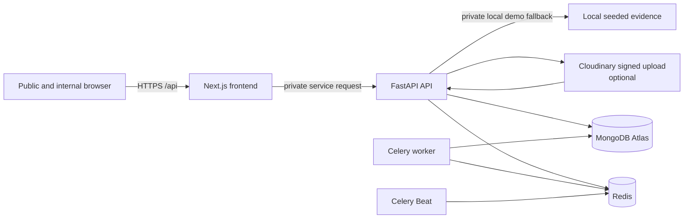

# Architecture

The frontend exposes same-origin UI routes and proxies API requests. FastAPI
owns authentication, RBAC, jurisdiction enforcement, privacy projections,
audit events, risk/evidence processing, and signed-upload issuance. MongoDB
stores application records, snapshots, jobs, notifications, and audit events.
Redis brokers Celery work; Celery Beat schedules exactly one dispatcher.

Cloudinary is required in production. The local seeded-file path is available
only outside production for a synthetic demo and never makes private evidence
publicly available.
